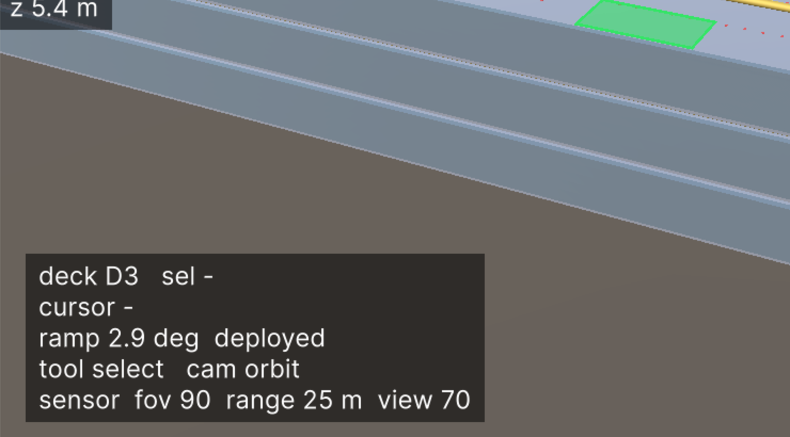
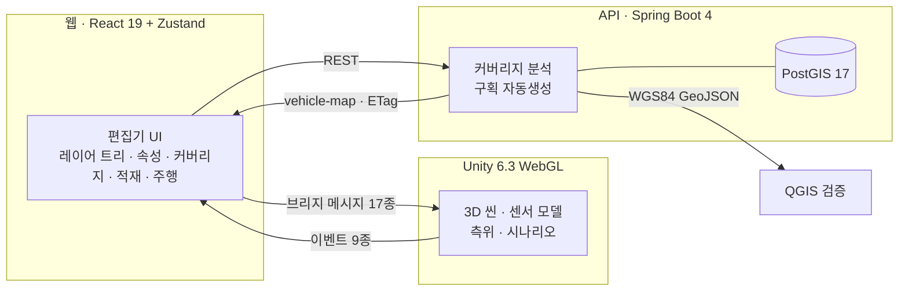

# Ship HD Map — 선박 내부 정밀지도 편집기 & 자율주차 시뮬레이터

> **자동차운반선(RORO) 안에서, 운전자 없는 차가 자기 위치를 어떻게 아는가.**
> 선내 정밀지도를 웹에서 만들고 → 그 지도가 **약속하는 정밀도**를 계산하고 → 실제로 차를 굴려 **약속이 지켜지는지** 확인하는 것까지, 한 화면에서 돈다.


<sub>왼쪽 레이어 트리 · 가운데 Unity WebGL 3D 씬 · 오른쪽 커버리지 패널 · 아래 평면도(σ 히트맵). 개인 학습·시연용 데모다.</sub>

---

## 한눈에

|  |  |
|---|---|
| **무엇** | 선박 내부 HD map 편집기 + 자율차 측위/주차 시뮬레이터. 브라우저 하나로 끝난다 |
| **왜 어려운가** | GNSS 가 안 들어오는 강철 선체 안에서, **파도에 흔들리는 바닥** 위에 mm 급 주차를 요구한다 |
| **핵심 아이디어** | 지도가 **"여기서 σ 몇 m 까지 잡을 수 있다"를 미리 계산**하고, 주행이 그 예측을 판정 기준으로 쓴다 |
| **스택** | Unity 6.3 (WebGL) · React 19 + Zustand · Spring Boot 4 + PostGIS · 전부 로컬 도커 |
| **규모** | Unity EditMode **164** · Vitest **93** · api **79** 테스트. 마일스톤 M1→M6 |
| **재현성** | 문서의 모든 그림과 숫자를 `./scripts/capture.sh` 가 다시 만든다 |

---

## 1. 풀려는 문제

자동차운반선은 한 번에 수천 대를 싣는다. 사람이 운전해 넣으면 층마다 기사가 타고 내려야 하고, 차 간격은 사람이 문을 열 수 있을 만큼 벌어져야 한다. **자율주차로 바꾸면 간격이 줄고 적재 대수가 늘어난다.** 그러려면 차가 선내에서 자기 위치를 알아야 하는데:

- **GNSS 가 없다.** 강철 선체 안이다.
- **바닥이 고정이 아니다.** 흘수·트림·횡경사·조위에 따라 갑판이 기울고 내려앉는다. 부두에서 본 좌표와 선내 좌표는 다른 세계다.
- **틀리면 비싸다.** 구획을 벗어나면 옆 차를 긁고, 못 들어가면 그 자리는 빈 채로 항해한다.

이 데모가 답하는 질문은 하나다 — **"지도를 이렇게 만들면, 차가 어디서 자기 위치를 잃는가?"** 그리고 그 답을 **지도를 만드는 단계에서** 알 수 있게 한다.

---

## 2. 어떻게 도는가 — 한 바퀴

### ① 지도를 만든다

선체·갑판·기둥·차로·주차구획·랜드마크를 코드 생성기가 만들고, 편집기에서 손으로 고친다. 좌클릭의 의미는 도구가 정한다(선택 / 배치 / 관측).

| | |
|---|---|
| **좌표계** | AP(선미수선) × 기선 × 중심선 원점, X 선수(+), **Y 좌현(+)**, Z 상방(+) |
| **레이어** | A2 차로중심선 · B2 노면표시·구획 · C 시설물 · LM 랜드마크(AprilTag 36h11) · LP 래싱포인트 |
| **불변식** | 선박은 강체 — **선내 좌표는 배가 어디에 어떻게 떠 있든 바뀌지 않는다.** WGS84 는 저장하지 않고 선박 자세에서 파생한다 |

### ② 지도가 무엇을 약속하는지 계산한다



커버리지 패널이 갑판을 1 m 격자로 훑어 **각 지점에서 달성 가능한 추정 정밀도 σ** 를 낸다. *보이는 마커 개수*가 아니라 **정보행렬에서 나오는 σ** 다 — 마커가 한쪽에 몰려 있으면 개수가 많아도 나쁘게 나온다.

- **지표의 분모는 구획과 차로 회랑이다.** 갑판 가장자리는 흐리게 그리기만 하고 숫자에서 뺀다. 차가 갈 일 없는 곳이 통계를 지배하면 추천이 거기를 메우러 간다.
- **선적(ψ=0)과 하역(ψ=180)을 따로 계산한다.** 시야각이 90° 라 주행 방향이 바뀌면 보이는 마커가 달라진다.
- **`추천`** 은 기둥·격벽 면에 가상 마커를 하나씩 놓아보고 사각지대를 가장 많이 줄이는 자리를 고른다. DB 는 안 건드린다 — `확정 저장` 을 눌러야 실제 랜드마크가 된다.

> **도구가 실제로 찾아낸 것:** 현재 픽스처의 Deck 3 은 마커가 `y = ±6.2` 한 줄뿐이라 **바깥 열 구획의 68 %** 에서 자세를 못 잡는다. 추천 3 개를 받으면 사각지대 23.5 % → 15.3 %, 바깥 열 86.4 % → 59.1 %.

### ③ 차를 굴려 약속을 검증한다

부두에서 GPS 로 출발 → 램프 진입 → **입구 랜드마크 쌍을 동시에 인식하는 순간 부두 좌표계를 버리고 선박 좌표계로 전환** → 차로 주행 → 구획 주차.


<sub>이 데모의 심장. 시나리오 로그의 <code>프레임 전환 · est x −24.01 y 0.28 psi −1.0</code> 이 그 순간이다. 선내 좌표가 부두 좌표와 무관하다는 주장이 실제로 값을 내는 유일한 지점.</sub>


<sub>차량 시선. 기둥의 마커 두 개가 마젠타 테로 "지금 보인다"를 표시하고, HUD 가 <code>sensor fov 90 range 25 m view 70</code> — 무엇으로 보는지 — 와 <code>seen 2 / 23</code> — 몇 개를 보는지 — 를 함께 말한다. 오른쪽 믿음 패널의 <code>σxy 실측 0.26 m · 예측 0.26 m · 1.0×</code> 가 ②의 약속과 ③의 실측이 만나는 자리다.</sub>

---

## 3. 설계에서 자랑할 만한 것

### 판정 기준이 "허용오차"가 아니라 "지도가 약속한 값"이다

차가 측위를 잃었는지 판단할 때, 고정 임계값 하나로는 차로(σ 0.28 m)와 구획(σ 0.54 m)을 같이 맞출 수 없다. 그래서 **실측 σ 가 그 지점의 예측 σ 의 `k` 배를 넘으면 저하**로 본다. 같은 정보행렬, 같은 야코비안으로 계산한 값이라 비교가 성립한다.

이 기준이 잡아내는 것은 **지도에 없는 문제**다 — 마커가 훼손됐거나, 차에 가렸거나. 지도가 "여기선 원래 안 보인다"고 말한 곳에서 안 보이는 건 정상이고, "여기선 보여야 한다"는 곳에서 안 보이면 이상이다.

### 상실 → 버팀 → 역추적 → 포기

마커가 하나도 안 보이면 오도메트리로 버틴다. σ 예산이 다하면 **정지**, 거리 한계에 닿으면 **역추적** — 지나온 자취를 되짚는다. 이미 통과한 길이라 안전이 확인된 유일한 경로이고, 형상만 따라가면 되어 절대 좌표가 필요 없다.

**역추적은 경로당 한 번뿐이다.** 물러섰다 같은 공백에 다시 들어가면 이번엔 눈을 감고 통과한다 — 안 그러면 피할 수 없는 공백에서 영원히 왕복한다. 두 번 실패한 구획은 `unreachable` 이 되어 평면도에서 회색으로 빠진다.

> Deck 3 하역 차로 선미에 **18.5 m** 짜리 사각지대가 있다. 지도 위에서 먼저 찾았고, 차가 실제로 통과할 때 눈먼 거리는 16.2 m, 오도메트리 오차 0.81 m 로 1.0 m 예산 안에 들었다. **도구가 예측한 결함을 주행이 같은 자리에서 만난다.**

### 진입할 수 없는 자리는 구획으로 만들지 않는다

래싱 격자에 맞춰 구획을 자동생성하되, **진입 경로(이탈점 → 45° 사선 → 5 m 직진)가 기둥에 막히거나 이탈점이 차로 밖이면 그 셀은 버린다.** Deck 3 기준 136 → 76 구획으로 줄지만, 선적·하역 중 차·기둥 통과 0건이다. 종이 위 적재율보다 실제로 넣을 수 있는 대수가 중요하다.

### 한 값에는 발신자가 하나

이 프로젝트가 반복해서 물린 함정이 **"같은 숫자를 두 곳이 각자 들고 있는 것"** 이다. 센서 기하(시야각·인식거리·시야한계)는 한때 세 벌이 있었다 — 웹 슬라이더, API 기본값, Unity 하드코딩. 그래서 커버리지 히트맵과 3D 관측점이 **같은 질문에 다른 답**을 했다.

지금은 웹이 단일 발신자이고, 와이어의 필드 이름을 커버리지 API 의 것과 **글자 그대로 같게** 잡았다 — 두 요청 본문을 나란히 놓고 눈으로 대조할 수 있게.

---

## 4. 시스템 구성



| 디렉터리 | 내용 |
|---|---|
| `unity/` | Unity 6.3 LTS(WebGL). **빌드 하나에 편집 모드 + 주행 모드.** 센서 모델·최소제곱 측위·시나리오 플래너 |
| `web/` | React 19 + Vite + TS + Zustand 5. Unity 캔버스를 품은 편집기. 화면 상태는 `localStorage`(스키마 버전 2) |
| `api/` | Spring Boot 4 + JdbcClient + PostGIS. 피처 CRUD · 시드 · vehicle-map(ETag) · 커버리지 분석 · GeoJSON export |
| `db/` | docker compose PostGIS 17 (호스트 5433) |
| `scripts/` | `m3-dev.sh`(전체 기동) · `m2-smoke.sh`(API 종단) · `capture.sh`(문서 그림·숫자 재생산) |
| `docs/` | 워크스루 · 설계 근거 · 용어집 · API 계약 · QGIS 검증 절차 |

### 측위 모델

랜드마크 관측은 `(거리 r, 방위 θ, 마커 방향각 α)` 세 값에 가우시안 노이즈를 더한 것이다(이미지 디코딩은 안 한다 — 태그 검출기의 **출력**을 흉내낸다).

- **N = 1** 폐형해, **N ≥ 2** Gauss-Newton (잔차 3N, 야코비안은 스펙에 명시)
- `Miss` 를 `bool` 이 아니라 **이유**로 돌려준다 — `None / Fov / Range / Facing / Occluded / Blocked`. 그래서 화면이 "왜 안 보이는지"를 그릴 수 있다
- 마커 방향각 한계(70°)가 이 도메인의 특징이다. AprilTag 은 정면에서 읽히고 비스듬해지면 못 읽는다 → **마커를 어느 방향으로 세우느냐**가 커버리지를 좌우한다

---

## 5. 검증

문서에 적힌 숫자를 못 믿게 만드는 가장 흔한 이유는 **다시 돌려볼 수가 없어서**다. 이 저장소에서 실제로 그 일이 있었다(`docs/qgis-check.md` 의 피처 수가 조용히 낡았다). 그래서:

```bash
./scripts/capture.sh     # 전용 데이터셋을 스스로 시드 → 주행 1회를 이벤트 단위로 정지시키며 캡처
                         # → docs/img/*.png + 숫자 요약표 (빌드 mtime 도장 포함)
```

- **결정론:** 두 번 돌리면 비교 스트림이 바이트 동일. 실행마다 달라지는 값(프레임 전환 추정, 주차 오차)은 삭제하지 않고 **분리해서 "이번 실행만"으로 표시**한다
- **작업용 DB 는 안 건드린다.** 캡처는 자기 데이터셋을 만들고 지운다
- **자동 테스트:** Unity EditMode 164 · Vitest 93 · api 79(Testcontainers) · `pnpm build`
- **브라우저 패스:** 마일스톤마다 실제 WebGL 빌드를 사람이 돌린다. 모든 관측에 `unity.wasm` 빌드 시각을 붙인다 — 안 그러면 보고서가 증거가 아니라 소문이 된다
- **QGIS:** WGS84 GeoJSON 을 내보내 외부 GIS 에서 상대 위치를 눈으로 확인 (`docs/qgis-check.md`)

> **자동 테스트가 구조적으로 볼 수 없는 결함이 있다.** 예: Unity 의 `SendMessage` 는 대상 오브젝트의 **모든 컴포넌트**에서 같은 이름 메서드를 호출하는데, 두 컴포넌트가 같은 이름을 갖고 있어 HUD 가 덮이는 버그가 있었다. 단위 테스트는 메서드를 직접 부르므로 영원히 못 잡는다 — 브라우저에서만 보였다. 지금은 **17개 와이어 이름 전부**에 대해 이름 충돌을 리플렉션으로 검사하는 구조적 테스트가 막는다.

---

## 6. 실행

**준비물:** Docker · JDK 25 · Node 22 + pnpm · Unity 6.3(WebGL 모듈)

```bash
# 1) Unity 에서 한 번: 메뉴 ShipHdMap/Build WebGL   (HUD 에셋은 저장소에 포함)
# 2) 전체 기동
./scripts/m3-dev.sh          # PostGIS 5433 → API 8081 → Vite 5173
```

`http://localhost:5173` 을 연다. API 만 확인하려면 `./scripts/m2-smoke.sh`.

<details>
<summary>알아두면 좋은 것</summary>

- 픽스처를 다시 시드했으면 **적재 계획 패널에서 구획을 재생성**한다(래싱 매핑 100 %).
- 램프 입구 랜드마크 쌍은 픽스처에 들어 있다. 예전 시드가 남아 있으면 부두→선박 프레임 전환이 갑판 코앞에서야 일어난다.
- 캡처 스크립트는 API·PostGIS·Vite 와 원격 디버깅 Chrome(9333)이 이미 떠 있다고 가정한다.
</details>

---

## 7. 문서

| 문서 | 내용 |
|---|---|
| [`docs/architecture-walkthrough.md`](docs/architecture-walkthrough.md) | **주행 한 번을 부두에서 주차까지 8장으로.** 각 구간의 좌표계·계산·해당 파일 |
| [`docs/design-rationale.md`](docs/design-rationale.md) | 왜 이렇게 했는가 |
| [`docs/glossary.md`](docs/glossary.md) | 용어집 |
| [`docs/api-contract.md`](docs/api-contract.md) | 엔드포인트 계약 |
| [`docs/qgis-check.md`](docs/qgis-check.md) | 외부 GIS 로 좌표 검증하는 절차 |
| [`docs/superpowers/specs/`](docs/superpowers/specs/) | 마일스톤별 설계 스펙 |

---

## 8. 진행 상태

| 마일스톤 | 내용 | 테스트 |
|---|---|---|
| **M1** | Unity 수직 슬라이스 | EditMode 39 |
| **M2** | 데이터·API (Testcontainers, QGIS 절차) | api |
| **M3a** | 웹 편집기 — 브라우저 편집 → DB | Vitest 15 |
| **M3b** | Unity 씬 UX — 궤도 카메라, 클릭 선택·드래그, UI Toolkit HUD | EditMode 49 · Vitest 19 |
| **M4** | 적재 계획 — 구획 자동생성 API, KPI, 3D 채움면 | api 42 · EditMode 53 · Vitest 22 |
| **M5a** | 갑판 주행·pose — 연속 선적·하역, 추정 기반 주차 판정 | api 46 · EditMode 81 · Vitest 26 |
| **M5b** | 부두·프레임 전환 — GPS 주행, 램프 진입, Ship Frame 전환 | EditMode 102 · Vitest 27 |
| **M5c** | 랜드마크 커버리지 — σ 히트맵, what-if, 그리디 배치 추천 | api 78 · Vitest 33 |
| **M5d** | 측위 상실·회복 — 예측 대비 저하 판정, 역추적, `unreachable` | api 79 · EditMode 133 · Vitest 38 |
| **M5e** | 편집기 UX — 도구 모드, 법선 기즈모, 카메라 셋, 가상 관측점, 단축키 | EditMode 158 · Vitest 86 |
| **M5f** | HUD 가 어느 눈이 살아 있고 몇 개를 보는지 말한다 | EditMode 160 · Vitest 87 |
| **M6** | **센서 경로 단일화 + 워크스루 문서 + 캡처 스크립트** | api 79 · EditMode 164 · Vitest 93 |

**다음:** 카메라 리그(눈 하나 → 여러 대) · 가변 내부 램프(3개 갑판 활용) · 항해 시뮬레이션

---

<sub>개인 학습·시연 목적의 데모입니다. 선박 제원과 정박 좌표는 임의값이며 실제 선박·항로를 나타내지 않습니다.</sub>
