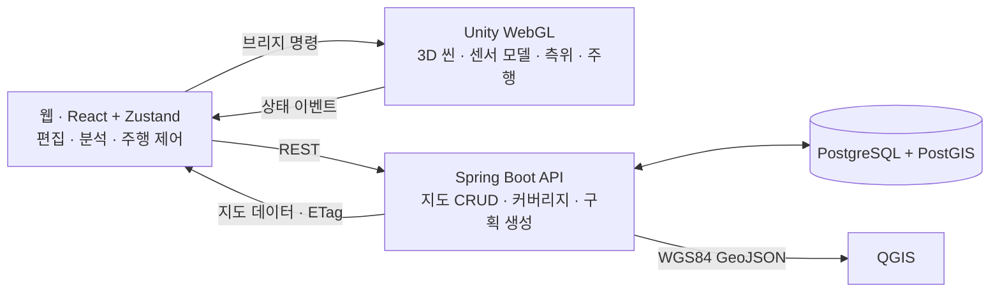

# Ship HD Map

**선박 내부 정밀지도 편집기 · 랜드마크 기반 측위 · 자율주차 시뮬레이터**

자동차운반선(RORO)의 내부 지도 편집, 랜드마크 기반 측위 분석, 차량 주행 시뮬레이션을 통합한 개인 학습·시연용 데모입니다. 핵심 목적은 GNSS를 사용할 수 없는 선내의 **측위 취약 구간 식별과 분석**입니다.

선박 제원과 정박 좌표는 임의값입니다. 센서와 차량 주행은 시뮬레이션이며, 실제 선박의 측위 성능이나 자율주행 안전성을 검증한 결과가 아닙니다.


*화면 구성: 지도 레이어(왼쪽) · Unity 3D 씬(가운데) · 커버리지 분석(오른쪽) · 평면도(아래)*

[주요 기능](#주요-기능) · [빠른 실행](#빠른-실행) · [시스템 구성](#시스템-구성) · [핵심 설계](#핵심-설계) · [검증 방법](#검증-방법) · [문서](#문서) · [진행 상태](#진행-상태)

## 주요 기능

| 기능 | 주요 내용 |
|---|---|
| 지도 편집 | 선체·갑판·기둥·차로·주차구획·랜드마크 생성 및 3D 화면 기반 선택·배치·수정 |
| 커버리지 분석 | 갑판의 위치별 추정 정밀도 시각화 및 랜드마크 추가 위치 추천 |
| 적재 계획 | 래싱 격자·진입 경로를 고려한 주차구획 생성 및 적재 상태 표시 |
| 주행 시뮬레이션 | 부두 출발 → 램프 진입 → 선내 주행 → 구획 주차 및 하역 |
| 측위 상태 분석 | 예측 정밀도와 주행 중 추정 정밀도 비교, 측위 상실·회복·역추적 상태 표시 |
| GIS 연계 | 선박 자세를 반영한 WGS84 GeoJSON 내보내기 및 QGIS 좌표 검증 |

### 기본 사용 흐름

1. **지도 편집:** 레이어·갑판 선택 후 선택·배치·관측 도구로 지도 요소 편집
2. **커버리지 분석:** 선적·하역 방향별 히트맵 조회 및 랜드마크 배치 추천. `추천` 결과는 미리보기이며, `확정 저장` 시 지도에 반영됩니다.
3. **구획 생성:** 적재 계획 패널에서 주차구획 생성. 픽스처 재시드 후에는 구획 재생성이 필요합니다.
4. **주행 시뮬레이션:** 부두 출발부터 주차까지 시나리오 실행 및 좌표계 전환·측위 상태 관찰

<details>
<summary>커버리지·주행 화면</summary>


커버리지 분석은 마커 개수뿐 아니라 관측 방향과 배치까지 고려한 추정 정밀도(σ, 표준편차)를 표시합니다. 분석 대상은 구획과 차로 회랑이며, 선적·하역 방향별로 계산합니다.


램프 입구의 랜드마크 쌍을 인식하면 부두 좌표계에서 선박 좌표계로 전환합니다.


주행 화면에는 인식 중인 마커, 센서 설정, 예측 정밀도와 주행 중 추정 정밀도가 표시됩니다. 구간별 해설은 [주행 워크스루](docs/architecture-walkthrough.md)에 정리되어 있습니다.

</details>

## 빠른 실행

### 준비 환경

| 도구 | 용도 |
|---|---|
| Docker | PostgreSQL 17 + PostGIS 3.5 실행 |
| JDK 25 | Spring Boot API 실행 |
| Node.js 22 + pnpm | 웹 개발 서버 실행 |
| Unity 6.3 LTS + WebGL Build Support | 3D 뷰어 빌드 · 프로젝트 버전: `6000.3.24f1` |

### 실행 순서

1. **WebGL 빌드:** Unity에서 `unity/` 프로젝트를 열고 **ShipHdMap → Build WebGL** 메뉴 실행. 출력 경로는 `web/public/unity/`입니다.
2. **개발 환경 시작:** 저장소 루트에서 아래 명령 실행

   ```bash
   ./scripts/m3-dev.sh
   ```

3. **웹 접속:** 브라우저에서 [http://localhost:5173](http://localhost:5173) 접속

스크립트는 DB → API → 웹 개발 서버 순서로 실행하고, 데모 데이터셋이 없으면 픽스처를 시드합니다. 웹 의존성도 설치합니다.

| 서비스 | 기본 포트 |
|---|---|
| 웹 | `5173` |
| API | `8081` |
| PostgreSQL | `5433` |

`JAVA_HOME`이 설정되지 않으면 스크립트는 `/opt/homebrew/opt/openjdk`를 사용합니다. 다른 환경에서는 JDK 25 경로를 지정해야 합니다.

```bash
JAVA_HOME=/path/to/jdk-25 ./scripts/m3-dev.sh
```

API 시작 로그 경로: `api/build/bootrun.log`

## 시스템 구성



| 경로 | 역할과 주요 기술 |
|---|---|
| [`web/`](web/) | React 19 · TypeScript · Vite · Zustand 5. 편집기 UI와 Unity 연동 |
| [`unity/`](unity/) | Unity 6.3 LTS. 편집·주행 모드, 센서 모델, 최소제곱 측위, 시나리오 실행 |
| [`api/`](api/) | Spring Boot 4 · JdbcClient. 지도 CRUD, 커버리지 분석, 구획 생성, GeoJSON 내보내기 |
| [`db/`](db/) | Docker Compose 기반 PostgreSQL 17 + PostGIS 3.5 |
| [`scripts/`](scripts/) | 개발 환경 기동, API 스모크 테스트, 문서용 화면 캡처 |
| [`docs/`](docs/) | 워크스루, 설계 근거, 용어집, API 계약, 검증 절차 |

## 핵심 설계

### 선내 지도와 선박 자세의 분리

선박을 강체로 가정하고, 선내 지도는 선박 기준 좌표로 저장합니다. 원점은 선미수선(AP)·기선·중심선의 교점이며, 축은 **X 선수(+), Y 좌현(+), Z 상방(+)**입니다. WGS84 좌표는 선박의 위치와 자세에서 파생합니다.

지도 레이어는 차로중심선(`A2`), 노면표시·구획(`B2`), 시설물(`C`), 랜드마크(`LM`), 래싱포인트(`LP`)로 나눕니다.

### 지도 분석·주행의 측위 모델 통일

랜드마크 관측값은 거리·방위·마커 방향각에 가우시안 노이즈를 더해 생성합니다. 실제 영상을 디코딩하지 않고 AprilTag 검출기의 출력을 모사합니다. 단일 관측은 폐형해로, 복수 관측은 Gauss–Newton 방식으로 위치와 방향을 추정합니다.

커버리지 분석과 주행은 같은 정보행렬·야코비안으로 정밀도를 계산합니다. 여기서 σ는 관측 모델로 추정한 불확실성이며, 실제 위치와 추정 위치 사이의 오차 자체는 아닙니다. 주행 중 관측으로 계산한 정밀도(σ)가 해당 위치의 예측 σ에 설정 배수를 곱한 값을 초과하면 측위 저하로 판단합니다. 센서의 시야각·인식거리·마커 방향각 한계는 웹 설정에서 API와 Unity로 전달합니다.

### 측위 상실 대응 및 진입 제약 처리

마커가 보이지 않는 동안에는 오도메트리로 위치를 추정하며, 불확실성 예산과 거리 한계에 따라 정지하거나 이전 경로를 역추적합니다. 반복 왕복을 막기 위해 경로당 역추적 횟수를 제한하고, 반복 실패한 구획은 `unreachable`로 표시합니다.

주차구획 생성 시에는 래싱 격자뿐 아니라 차로에서 구획까지의 진입 경로도 검사합니다. 경로가 기둥에 막히거나 이탈점이 차로 밖인 후보는 제외합니다. 자세한 계산과 제약은 [설계 근거](docs/design-rationale.md)와 [설계 스펙](docs/superpowers/specs/)에 정리되어 있습니다.

## 검증 방법

### 자동 테스트와 빌드

아래 명령은 저장소 루트에서 실행합니다. API 테스트는 Testcontainers를 사용하므로 Docker가 필요합니다.

```bash
pnpm --dir web test
pnpm --dir web build
(cd api && ./gradlew test)
```

Unity 테스트는 에디터의 **Window → General → Test Runner → EditMode**에서 실행합니다. 브리지 연동과 WebGL 화면은 브라우저에서 별도 검증합니다.

API 통합 검증 스크립트는 `./scripts/m2-smoke.sh`입니다. 이 스크립트는 DB와 API를 기동하고 `roro-demo-01`에 픽스처를 시드한 뒤 CRUD·ETag·선박 자세·GeoJSON 내보내기를 검사합니다. 개발 서버와 별도로 실행하며, 기존 데모 데이터가 변경될 수 있습니다.

### 화면 캡처·외부 GIS 검증

문서의 스크린샷과 실행 수치는 특정 픽스처·센서 설정·빌드의 결과입니다. 캡처 스크립트로 실행 결과를 재생성할 수 있으며, 구간별 분석은 [주행 워크스루](docs/architecture-walkthrough.md)에 정리되어 있습니다.

<details>
<summary>문서용 캡처 실행 조건</summary>

`./scripts/capture.sh`는 서비스를 직접 시작하지 않습니다. 다음 환경을 먼저 준비해야 합니다.

- WebGL 빌드와 `psql` 명령
- PostgreSQL(`5433`), API(`8081`)
- Vite(`5399`): `pnpm --dir web dev --port 5399 --strictPort`
- 원격 디버깅 포트 `9333`으로 실행한 Chrome과 `http://localhost:5399/` 탭

```bash
./scripts/capture.sh
```

스크립트는 전용 데이터셋 `roro-demo-cap`을 삭제·재생성하고, `docs/img/`의 캡처 이미지와 실행 요약을 생성합니다. 작업용 데이터셋 `roro-demo-01`과 분리되어 있습니다.

</details>

WGS84 GeoJSON의 외부 GIS 검증은 [QGIS 확인 절차](docs/qgis-check.md)를 따릅니다.

## 문서

| 문서 | 주요 내용 |
|---|---|
| [주행 워크스루](docs/architecture-walkthrough.md) | 부두 출발부터 주차까지 구간별 화면·좌표계·계산·관련 코드 |
| [설계 근거](docs/design-rationale.md) | 설계 선택의 배경과 제약 |
| [용어집](docs/glossary.md) | 좌표계·측위·센서 관련 용어 |
| [API 계약](docs/api-contract.md) | 엔드포인트와 요청·응답 형식 |
| [QGIS 확인 절차](docs/qgis-check.md) | 내보낸 지도 좌표의 외부 GIS 검증 절차 |
| [마일스톤별 설계 스펙](docs/superpowers/specs/) | 기능별 상세 요구사항과 계산식 |

## 진행 상태

- **구현 범위:** M1~M6
- **확장 후보:** 다중 카메라 리그, 가변 내부 램프, 항해 시뮬레이션

<details>
<summary>마일스톤별 구현 내용</summary>

| 마일스톤 | 구현 내용 |
|---|---|
| M1 | Unity 기본 씬과 좌표계 |
| M2 | 데이터 모델·API·QGIS 검증 절차 |
| M3a / M3b | 웹 편집기와 DB 연동, Unity 카메라·선택·드래그·HUD |
| M4 | 주차구획 자동생성, 적재 KPI, 3D 적재 상태 표시 |
| M5a / M5b | 연속 선적·하역, 추정 기반 주차 판정, 부두·선박 좌표계 전환 |
| M5c / M5d | 커버리지 히트맵·배치 추천, 측위 저하 판정·역추적·도달 불가 처리 |
| M5e / M5f | 편집 도구·법선 기즈모·가상 관측점·단축키, 센서 상태 HUD |
| M6 | 센서 설정 전달 경로 통합, 워크스루 문서, 캡처 스크립트 |

</details>
