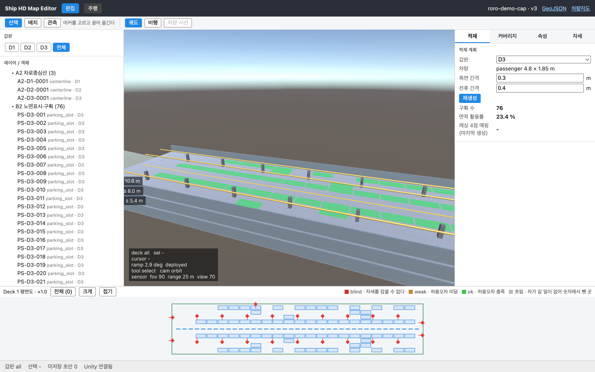
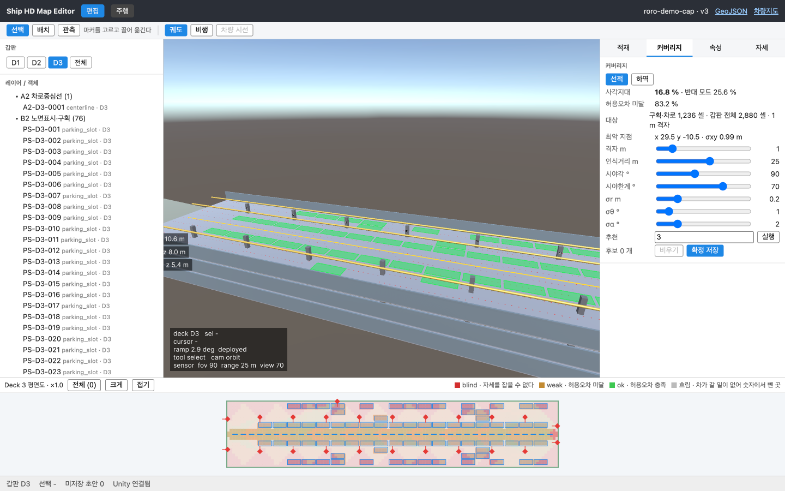
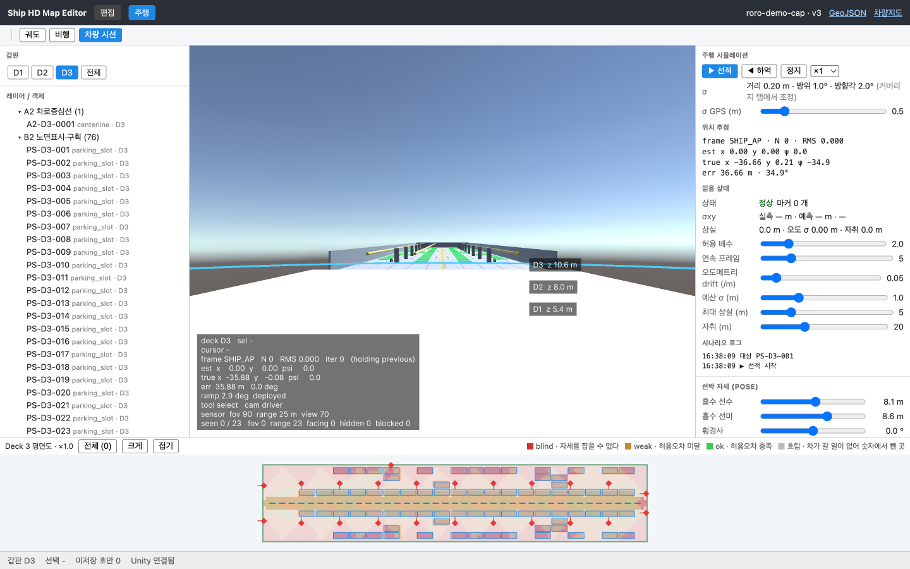
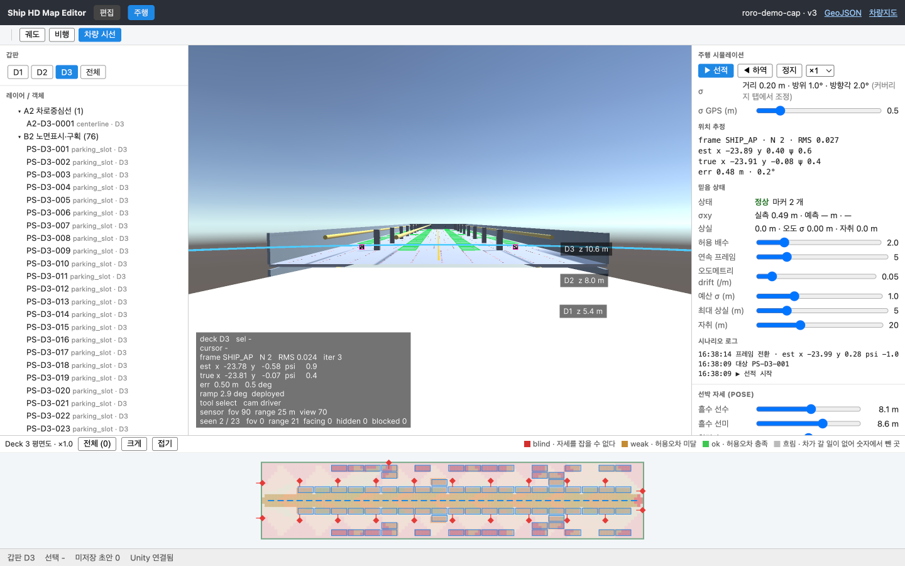
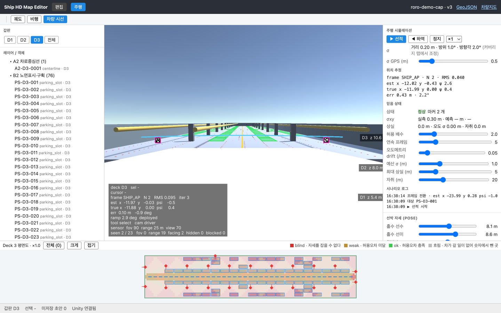
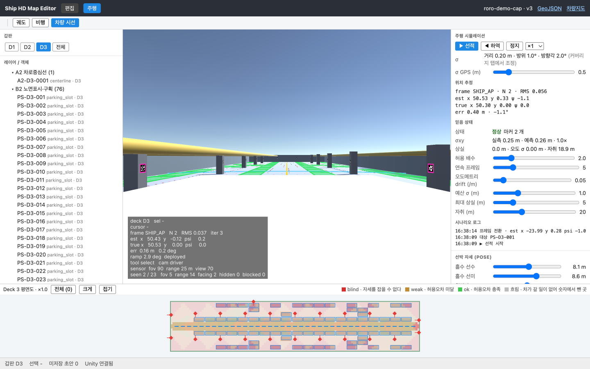
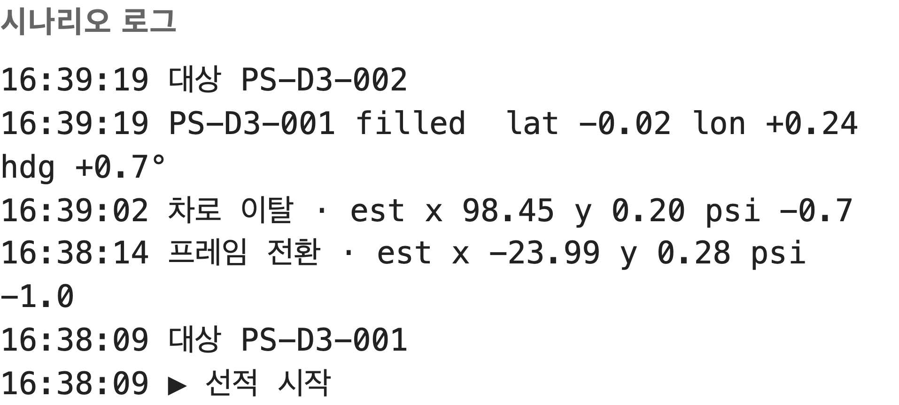
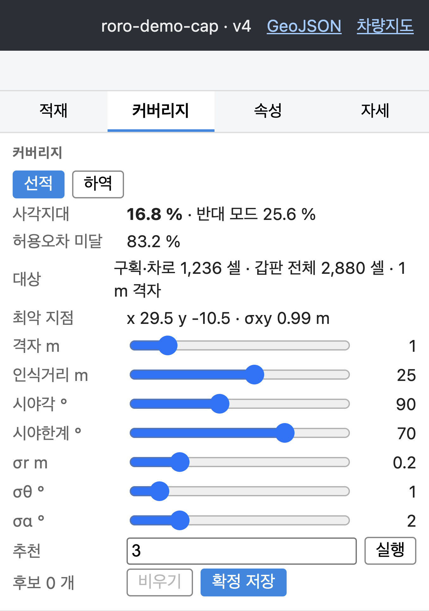

# 주행 한 번을 끝까지 따라가기

> 이 문서의 그림과 숫자는 전부 `./scripts/capture.sh` 가 만든다. 의심스러우면 다시 돌려서 요약표와 대조한다.
> 기준 빌드: `unity.wasm` `2026-09-21 10:44:40` · 데이터셋: `roro-demo-cap` (`docs/fixtures/vehicle-map.sample.json` 시드 + Deck 3 구획 자동생성) · `v3` · 3 갑판 · 4,805 피처

안벽에 선 차 한 대가 구획 `PS-D3-001` 에 들어가 판정을 받기까지를 여덟 장으로 나눠 따라간다. 각 장은 하나만 답한다: **지금 어느 좌표계에 있고, 무엇이 계산되고, 그 코드가 어디 있는가.**

장 경계는 새로 만든 것이 아니라 `MapRuntime.Phase` 와 시나리오 이벤트가 이미 갖고 있는 것이다. 위상이 하나 늘면 이 문서는 빠진 장을 스스로 드러낸다.

| 장 | 코드의 경계 | 그림 |
|---|---|---|
| [1 배와 좌표계](#1-배와-좌표계) | (정지) | `01-frames` |
| [2 지도가 약속하는 것](#2-지도가-약속하는-것) | (편집 모드) | `02-coverage` |
| [3 부두](#3-부두) | `Phase.OnQuay` | `03-quay` |
| [4 프레임 전환](#4-프레임-전환) | `frame_switch` 이벤트 | `04-frame-switch` |
| [5 램프](#5-램프) | `Phase.OnRamp` | `05-ramp` |
| [6 차로](#6-차로) | `Phase.OnLane` | `06-lane` |
| [7 주차](#7-주차) | `Phase.Parking` → 판정 | `07-parked-log` |
| [8 약속과 실측의 대조](#8-약속과-실측의-대조) | (정지) | `08-promise-vs-measured` |

**램프는 `frame_switch` 뒤, `leave_lane` 앞이다.** 순서를 거꾸로 기억하기 쉬운 자리라 미리 적는다 — 차는 안벽에서 이미 선박 프레임으로 넘어간 뒤에 램프를 오른다. 그리고 램프는 자기 로그 줄이 없다: `프레임 전환` 줄과 `차로 이탈` 줄 사이의 구간이 램프다.

장마다 전체 프레임 한 장과 HUD 확대 클립(`-hud`) 한 장이 있고, 7장만 로그 클립이 하나 더 있다.

### 숫자의 등급

| 등급 | 무엇 | 어디서 |
|---|---|---|
| **고정** | 지도·구획·커버리지 수치, 센서 파라미터, 장 경계, 빌드 스탬프 | 캡처 스크립트의 stdout 요약표. 몇 번을 돌려도 같다 |
| **이번 실행만** | `est` 값, 주차 오차, 판정(`filled`/`needs_adjust`) | 캡처 스크립트의 stderr. **실행마다 바뀐다** — 이유는 [8장](#8-약속과-실측의-대조) |

아래에서 "이번 실행" 이라고 적은 숫자는 그림에 찍힌 예시일 뿐이다. 같은 값을 다시 볼 것이라고 기대하면 안 된다.

---

## 1. 배와 좌표계



정지 상태의 배다. 갑판 셋이 겹쳐 보이고 왼쪽 라벨이 각 갑판의 높이를 적는다 — `z 5.4` / `z 8.0` / `z 10.6` m. 오른쪽 적재 패널은 Deck 3 이 `passenger 4.8 × 1.85 m` 차량 기준으로 **76 구획, 면적 활용률 23.4 %** 라고 말한다. 아래 평면도는 같은 갑판을 위에서 본 것이다.

HUD([`01-frames-hud.png`](img/01-frames-hud.png))의 마지막 줄 `sensor fov 90 range 25 m view 70` 은 지금 기억해 두면 된다. 8장에서 다시 쓴다.

**좌표계는 셋이고, 이 문서는 매 장마다 어느 것인지 밝힌다.**

| 이름 | 정의 | 언제 |
|---|---|---|
| **Ship Frame** | `x` 선미수선(AP)에서 선수 방향, `y` 좌현 +, `z` 기선에서 위, ψ 는 `+x` 에서 반시계 | 지도의 **모든** 좌표. 4~8장 |
| **Quay Frame** | Unity 월드 좌표. 차가 Map 루트에 붙어 있지 않은 동안의 프레임 | 3장 |
| **WGS84** | `ap_lat` / `ap_lon` / `heading_deg` 세 값이 Ship Frame 을 지구에 앉힌다 | GeoJSON 내보내기, QGIS 대조 |

Ship Frame 의 정의는 세 언어에 각각 있고 서로 같다: `unity/Assets/ShipHdMap/Runtime/Core/ShipFrame.cs`, `api/src/main/java/com/shiphdmap/api/geo/ShipFrame.java`, `web/src/geo/shipFrame.ts`.

주의할 것 둘:

- **Unity 엔진 축은 Ship Frame 이 아니다**(엔진은 `x` 전방, `y` 위, `z` 우현). 변환은 `ToUnity(x,y,z) → (x, z, -y)` 하나뿐이고, 그 덕에 **Unity yaw 가 곧 선수각**이라 각도 변환이 없다.
- **`georef.heading_deg` 와 ψ 는 다른 양이다.** 앞은 진북 기준 시계방향 선수 방위각이고 WGS84 변환에만 쓴다. ψ 는 `+x` 축에서 반시계다.

**파일** — `ShipFrame.cs` · `ShipFrame.java` · `shipFrame.ts`(`toWgs84`) · 갑판과 선체를 그리는 `ShipMeshBuilder.cs` · 지도 피처를 씬에 얹는 `MapOverlay.cs`

---

## 2. 지도가 약속하는 것



Deck 3 만 남기고 커버리지 탭을 연 화면이다. 평면도의 색이 셀별 판정이고, 오른쪽 패널이 그것을 숫자로 요약한다.

| 항목 | 값 |
|---|---|
| 사각지대 | **16.8 %** (반대 모드 25.6 %) |
| 허용오차 미달 | **83.2 %** |
| 대상 | 구획·차로 **1,236 셀** · 갑판 전체 2,880 셀 · 1 m 격자 |
| 최악 지점 | x 29.5 y −10.5 · σxy **0.99 m** |

**분모가 갑판이 아니다.** 1,236 은 구획과 차로가 덮는 셀이고, 2,880 은 갑판 전체다. 차가 갈 일이 없는 셀은 그려지기는 하되 흐리게 그려지고 비율에는 들어가지 않는다.

**어떤 계산인가.** 주행은 전혀 없다. Ship Frame 1 m 격자의 각 셀 중심에 차가 차로 방향으로 서 있다고 놓고, 순수 기하로만 답한다.

1. **보이는 마커 세기** — 세 조건: 거리 ≤ 인식거리 25 m, 차량 정면 기준 |방위| ≤ 시야각 90°/2, 마커 법선 기준 |입사각| ≤ 시야한계 70°.
2. **정보행렬 쌓기** — 관측마다 야코비안을 `1/σ²` 로 가중해 3×3 행렬 `A` 에 누적한다. 가중치의 σ 가 패널의 σr 0.2 m · σθ 1° · σα 2° 다.
3. **σ 뽑기** — `A⁻¹` 의 대각에서 σxy 와 σψ. 마커가 0 개거나 `A` 가 역행렬이 없으면 **사각지대**.
4. **판정** — `stability = min(0.15 / σxy, 2.0 / σψ)`. 1 보다 작으면 **허용오차 미달**.

3번의 `0.15 m` 와 `2.0°` 는 임의의 상수가 아니라 **7장의 주차 판정이 쓰는 바로 그 허용오차**다(`CoverageAnalyzer.TOL_LAT_M` / `TOL_HEADING_DEG` ↔ `ScenarioPlanner.Judge` 의 `tol`). 히트맵은 "여기 서면 주차 판정을 통과할 만한 정밀도가 나오는가"를 미리 계산한 것이다.

**파일** — `api/src/main/java/com/shiphdmap/api/coverage/CoverageAnalyzer.java`(`visible` / `estimate` / `stability` / `analyze`) · `CoverageController.java` · `web/src/components/CoveragePanel.tsx` · `web/src/geo/coverage.ts`

---

## 3. 부두



차량 시선으로 바꾼 첫 장이다. 배는 아직 멀고, 화면에 마커 링은 하나도 없다.

HUD([`03-quay-hud.png`](img/03-quay-hud.png))가 그것을 숫자로 말한다 — `seen 0 / 23   fov 0  range 23`: 마커 23 개가 전부 **거리** 때문에 탈락했다. 해가 없으니 `N 0   RMS 0.000   iter 0   (holding previous)` 이고, `est x 0.00 y 0.00` 는 추정이 원점에 있다는 뜻이 아니라 **직전 해가 없어 초기값을 들고 있다**는 뜻이다. 그래서 `err 35.88 m` 도 추정 오차가 아니다. 오른쪽 믿음 패널의 `σxy 실측 — · 예측 —` 도 같은 사실의 다른 표현이다.

**좌표계는 Quay Frame 이다.** 차는 `Vehicle.transform.SetParent(null, true)` 로 Map 루트에서 떼어져 Unity 월드에 놓인다.

**무엇이 계산되는가.** 차가 가진 것은 GPS 하나다.

1. 진값 `(-45, 6)` 에 스폰한다(`ScenarioPlanner.QuaySpawn`).
2. `Sensor.Gps(truth)` 가 x·y 에 σ GPS 0.5 m 짜리 가우스 잡음을 얹은 **추정** 하나를 준다. 선수각은 나침반/IMU 로 아는 것으로 두어 그대로 복사한다.
3. 그 **추정 프레임**에서 램프 발치까지 경로를 그린 뒤(`QuayPath`), `ToTruthFrame` 으로 진짜 프레임에 옮겨 실행한다.

3번이 핵심이다. 차는 자기가 틀렸다는 것을 모르므로, **GPS 오차만큼 비뚤게 램프를 향한다.** σ GPS 를 0 으로 내리면 정확히 정중앙으로 들어간다.

HUD 가 `frame SHIP_AP` 라고 적는 것은 모순이 아니다. 지도와 센서가 선박 프레임에 살기 때문에, 차가 Quay Frame 을 달리는 동안에도 **진값은 Map 루트의 역변환으로 선박 프레임에 투영해서** 관측을 계산한다(`MapRuntime.ShipTruthPose`). HUD 의 `est`/`true` 는 그 투영된 값이다.

**파일** — `MapRuntime.NextVehicle`(Quay 분기) · `ScenarioPlanner.cs`(`QuaySpawn` / `QuayPath` / `ToTruthFrame`) · `LandmarkSensor.Gps`

---

## 4. 프레임 전환



이 데모에서 "선내 좌표는 부두 좌표와 무관하다"는 주장이 실제로 값을 내는 **유일한 순간**이다.

HUD([`04-frame-switch-hud.png`](img/04-frame-switch-hud.png))에 마커 두 개가 처음 잡혔다 — `seen 2 / 23   fov 0  range 21`. 해가 나오기 시작한다: `N 2   RMS 0.024   iter 3`, 이번 실행의 값으로 `est x -23.78 y -0.58 psi 0.9` 대 `true x -23.81 y -0.07 psi 0.4`, `err 0.50 m  0.5 deg`.

**트리거는 시계가 아니라 사건이다.** 램프가 지정한 `transition_landmarks` 두 개(`LM-0022`, `LM-0023`)를 **같은 프레임에 둘 다** 봤을 때 넘어간다(`SawEntrancePair()`). 하나만 보이는 동안은 넘어가지 않는다.

그 프레임에서 세 가지가 한꺼번에 일어난다.

1. **부모 교체** — `SetParent(transform, true)`. 월드 포즈는 그대로 둔 채 부모만 Unity 월드 → Map 루트로 바꾼다. 이후 차의 좌표는 선박 프레임이고, 배가 흘수나 횡경사로 움직이면 차도 함께 움직인다.
2. **경로 재계획** — **이 순간의 추정 하나**(`_prev`)로 램프 상단까지의 경로를 그린다(`RampTopPath`). 추정이 틀린 만큼 램프 꼭대기에 비뚤게 오른다. 그 뒤는 차로 추종이 다시 중앙으로 당겨 준다.
3. **이벤트 발행** — `frame_switch` 를 `detail: "est x … y … psi …"` 와 함께 내보낸다. 로그 패널의 `프레임 전환 · est …` 줄이 그것이고, 실려 있는 값이 바로 2번이 쓴 추정이다.

2번에서 추정이 없으면 진값으로 떨어지는 게 아니라 마지막으로 **유한했던** 해를 쓴다(`_prev ?? ShipTruth()`, 그리고 `_prev` 는 `IsFinite` 를 통과한 해에서만 갱신된다). 이 데모가 보여 주려는 것이 추정 오차인데 여기서 진값이 새면 볼 것이 없어진다.

**파일** — `MapRuntime.StepScenario` 의 `case Phase.OnQuay when SawEntrancePair()` · `MapRuntime.SawEntrancePair` · `ScenarioPlanner.RampTopPath` / `ToTruthFrame` · 램프 정의는 `docs/fixtures/vehicle-map.sample.json` 의 `ramps[0]`

---

## 5. 램프



램프는 안벽 발치(x ≈ −24)에서 차로 시작점(x = 2)까지 오른다. 이 그림은 그 중간을 고정하려고 **`true x ≥ -12 m` 인 첫 추정**에서 찍었다 — 시각이 아니라 **장소**로 정했기 때문에 프레임률이 달라도 같은 갑판 위치가 찍힌다.

HUD([`05-ramp-hud.png`](img/05-ramp-hud.png)): `est x -11.97 y -0.03` / `true x -11.88 y 0.00` / `err 0.10 m  -0.9 deg`, `seen 2 / 23`, `ramp 2.9 deg  deployed`.

**이 장의 요점은 오른쪽 믿음 패널에 있다.**

```
σxy    실측 0.30 m · 예측 — m · —
```

**예측이 비어 있다.** 커버리지 격자의 bbox 는 갑판 외곽인 `[0, -12] ~ [120, 12]` 이고, 램프는 `x < 0` 이라 격자 밖이다. `PredictionGrid.SigmaAt` 은 셀이 없으면 `null` 을 돌려주고 — **지도가 약속하지 않은 자리와 지도가 사각지대라고 말한 자리를 일부러 같은 답으로 둔다.** 둘 다 "이 값을 대볼 기준이 없다"는 뜻이기 때문이다. `BeliefMonitor` 는 약속이 없으면 "약속보다 나쁨" 판정을 건너뛰고, 관측 수만으로 도는 상실/후진 판정은 그대로 돌린다.

한 겹 더 있다. **믿음 감시 자체가 `OnLane` / `Parking` / `Departing` 에서만 돈다**(`MapRuntime.Step`). 안벽과 램프에서는 마커가 없거나 적어 `nObs` 가 0 이 되는 게 정상인데, 감시를 켜 두면 정상 주행마다 상실로 빠진다. 그래서 두 구간에서는 `Belief.Reset()` 만 한다.

**파일** — `unity/Assets/ShipHdMap/Runtime/Vehicle/PredictionGrid.cs` · `BeliefMonitor.cs` · `MapRuntime.Step`(위상별 감시 분기) · `ScenarioPlanner.RampTopPath`

---

## 6. 차로



차로 중간, **`true x ≥ 50 m` 인 첫 추정**이다. 기둥에 달린 마커 두 개가 자홍색 링으로 표시돼 있다 — 지금 해에 실제로 들어간 관측이다.

HUD([`06-lane-hud.png`](img/06-lane-hud.png)): `N 2   RMS 0.037   iter 3`, `est x 50.43 y -0.12` / `true x 50.53 y 0.00`, `seen 2 / 23   fov 5  range 14  facing 2`. 23 개 중 21 개가 탈락한 이유까지 적혀 있다.

**좌표계는 Ship Frame 이고, 매 렌더 프레임 네 단계가 돈다**(`MapRuntime.Localize`).

1. `Sensor.VisibleFrom` — 마커별로 보이는지, 안 보이면 왜인지(`fov` / `range` / `facing` / `hidden` / `blocked`)를 낸다. 차량 시선이 그리는 콘과 링이 이 판정 그대로다.
2. `Sensor.Sense` — 보이는 것마다 거리·방위·입사각에 가우스 잡음을 얹는다(σr 0.2 m · σθ 1° · σα 2°).
3. `Localizer.Solve` — Gauss-Newton 으로 포즈를 푼다. 잔차 가중은 `1/σ²`, 즉 **2장의 커버리지가 쓴 것과 같은 가중**이다.
4. `Localizer.Information` — 같은 `A⁻¹` 대각에서 σxy·σψ 를 낸다.

차로 구간은 차로 추종이라 추정 오차가 누적되지 않는다. 매 프레임 새로 풀고, 틀린 만큼 다시 중앙으로 당겨진다.

오른쪽 믿음 패널(이번 실행):

```
σxy    실측 0.26 m · 예측 0.26 m · 1.0×
상실   0.0 m · 오도 σ 0.00 m · 자취 19.2 m
```

**실측이 예측과 같다.** 이 두 숫자를 나란히 놓을 수 있다는 것이 8장의 주제다.

**파일** — `LandmarkSensor.cs`(`VisibleFrom` / `Sense` / `AddNoise`) · `Localizer.cs`(`Solve` / `Information` / `Weight`) · `LaneFollower.cs` · `SensorView.cs`(콘·링) · `web/src/components/DrivePanel.tsx`(믿음 패널)

---

## 7. 주차



판정(`onSlotFilled`)과 다음 차의 `target`은 `NextVehicle`의 같은 프레임에서 발생한다. 따라서 방금 주차한 차의 판정값을 그대로 남긴 시나리오 로그 클립을 이 장의 주 그림으로 삼는다. 캡처할 때만 로그 본문을 줄바꿈해 `lat` · `lon` · `hdg` 판정값이 한 그림 안에 모두 보인다.

**무엇이 계산되는가.** 차로를 뜨는 순간이 전부다.

1. **이탈 지점** — 목표에서 `FinalRunM` 5 m 에 횡오프셋 `|t.y − laneY|` 를 더한 만큼 앞(`ExitS`). 접근이 45° 대각 + 마지막 직진 5 m 가 되도록 잡은 값이다.
2. **경로 계획** — 그 순간의 **추정 하나**로 목표까지 경로를 그리고(`ApproachPath`), `ToTruthFrame` 으로 옮겨 **개루프**로 실행한다. 이후 프레임의 추정은 경로에 반영되지 않는다.
3. **판정** — 도착하면 `Judge` 가 **진값**과 `target_pose` 를 비교한다. 목표 선수각 기준으로 종·횡으로 분해한 뒤 `lat 0.15 m` / `lon 0.30 m` / `heading 2.0°` 와 대고, 셋 다 통과면 `filled`, 하나라도 넘으면 `needs_adjust`.

2번이 이 데모의 구조적 선택이다. **차로를 뜨는 순간의 추정 오차가 그대로 주차 오차가 된다.** 매 프레임의 추정으로 다시 조준하는 폐루프가 개선 방향이고, 코드에도 그렇게 적혀 있다.

또 하나, 이탈이 정확히 이탈 지점에서 일어나도록 한 프레임을 되감는다(`Vehicle.Rewind(_exitS)`). 시간 배율이 높으면 한 프레임에 수 미터를 지나가고, 그 초과분이 고스란히 주차 오차에 얹히기 때문이다.

**파일** — `MapRuntime.StepScenario` 의 `case Phase.OnLane when …` 와 `case Phase.Parking when Vehicle.AtEnd` · `ScenarioPlanner.cs`(`ExitS` / `ApproachPath` / `Judge` / `FinalRunM`) · `MapOverlay.SetStatus` / `SpawnParked`

---

## 8. 약속과 실측의 대조



`정지` 를 눌러 편집 모드로 나온 뒤 커버리지가 새로 계산될 때까지 기다린다. 이후 트리의 `PS-D3-001`을 선택해 방금 주차한 결과를 확인하고, 커버리지 패널을 다시 열어 상단 버전과 최종 계산이 함께 보이도록 확대해 찍는다.

패널의 숫자는 2장과 글자 하나까지 같다: 사각지대 16.8 % · 반대 모드 25.6 % · 허용오차 미달 83.2 % · 1,236 / 2,880 셀 · 최악 지점 σxy 0.99 m. 커버리지는 주행 결과와 무관한 정적 계산이므로 같은 것이 맞다. 달라진 것은 상단바의 `v3` → `v4` 뿐이다.

### 8.1 이 비교가 성립하는 이유

2장의 예측과 6장의 실측을 나란히 놓을 수 있는 것은 **둘이 같은 센서 파라미터로 나왔기 때문이다.**

| | 2장 (예측) | 3~7장 (실측) |
|---|---|---|
| 기하 | 커버리지 슬라이더 — 시야각 **90**° · 인식거리 **25** m · 시야한계 **70**° | HUD 의 `sensor fov 90  range 25 m  view 70` ([`08-…-hud.png`](img/08-promise-vs-measured-hud.png), [`02-…-hud.png`](img/02-coverage-hud.png) 에도 같은 줄) |
| 잡음 | 커버리지 슬라이더 — σr **0.20** m · σθ **1.0**° · σα **2.0**° | 주행 패널 σ 행 — `거리 0.20 m · 방위 1.0° · 방향각 2.0°` |

여섯 값이 같은 데서 그치지 않는다. **출처가 하나다.** 웹 스토어의 `coverageParams` 객체 하나가 세 갈래로 나간다 — 히트맵의 커버리지 POST 본문, `sensorMsg()` / `noiseMsg()` 를 거친 브리지의 `SetSensor` / `SetNoise`, 그리고 주행 시작 시 `predictionMsg()` 가 조립하는 예측 격자 POST(그 응답이 `SetPrediction` 으로 들어가 8.2 의 "지도의 약속"이 된다). 슬라이더를 움직이면 히트맵과 차와 약속이 **같이** 바뀐다.

이 문서를 쓸 수 있게 된 게 그 지점이다. 그 전까지 히트맵은 웹 슬라이더를 읽고 씬 안의 센서는 Unity 쪽 상수를 읽었으며, **둘을 잇는 코드가 없었다.** 두 σ 가 우연히 같은 값일 수는 있어도 같은 값이라는 보장이 없었으니, 나란히 놓는 것 자체가 의미가 없었다.

주행 패널의 σ 행이 슬라이더가 아니라 읽기 전용 표시에 `(커버리지 탭에서 조정)` 을 달고 있는 것도 같은 이유다. 조정 지점이 둘이면 다시 갈라진다.

### 8.2 약속은 지켜졌다

차로 중간(x ≈ 50)에서:

| | σxy |
|---|---|
| 지도의 약속 (커버리지 셀 x 50.5 y 0.5, 마커 2 개) | **0.26 m** |
| 6장의 실측 (이번 실행) | **0.26 m** · 비 **1.0×** |

달성 가능한 정밀도가 지도가 미리 계산해 둔 값과 일치했다. 지도가 "이 자리에서는 마커 2 개가 보이고, 그걸로 낼 수 있는 최선은 0.26 m" 라고 말했고, 실제 해가 그대로 나왔다.

### 8.3 그런데 판정은 실행마다 갈린다 — 그리고 그것도 지도가 말한 대로다

같은 구획이 어떤 실행에서는 `filled`, 다른 실행에서는 `needs_adjust` 가 된다. 주차 오차 숫자도 매번 다르다. 모순이 아니라, 8.2 와 **같은 사실의 다른 면**이다.

- 횡 허용오차는 **0.15 m** 다. 그 자리의 약속은 **0.26 m** 다.
- 그러므로 `stability = 0.15 / 0.26 = 0.59 < 1` — 그 셀은 **허용오차 미달**로 세어진다. 대상 셀의 **83.2 %** 가 그렇다.
- 즉 지도는 처음부터 **"이 갑판 대부분에서는 0.15 m 를 못 맞춘다"** 고 말하고 있었다.
- σ 는 **퍼짐**이지 한 번의 오차가 아니다. σ 0.26 m 에서 뽑은 표본 하나는 0.15 m 안에 들어올 수도, 안 들어올 수도 있다. **판정이 실행마다 뒤집히는 것이 바로 그 모습이다.**

왜 매번 다른 표본이 되는가: 센서 잡음은 **렌더 프레임마다** 뽑힌다(`LandmarkSensor.Sense` → `Gauss`). 시드는 `Awake()` 에서 1 로 고정이라 난수열 자체는 재현되지만, **두 사건 사이에 몇 개를 뽑았는지는 프레임률에 달려 있다** — 시뮬레이션이 `Time.deltaTime` 으로 진행하기 때문이다. 그래서 `차로 이탈` 순간의 추정이 달라지고, 7장의 개루프 구조가 그 오차를 그대로 주차 오차로 옮긴다.

**이 데모에서 고칠 것은 주차 판정이 아니라 지도다.** 2장 패널의 `추천` 버튼이 그것을 위해 있다 — 마커를 어디에 더 달면 사각지대와 허용오차 미달이 얼마나 내려가는지 계산해서 순위로 준다.

**파일** — `web/src/store/editor.ts`(`noiseMsg` / `sensorMsg`, 두 경로의 단일 출처) · `web/src/bridge/useShipUnity.ts`(`SetSensor` / `SetNoise` 발송) · `MapRuntime.SetSensor` / `SetNoise` · `HudView.SensorConfigLine` · `CoverageAnalyzer.stability` · `ScenarioPlanner.Judge` · `LandmarkSensor.Sense`

---

## 다시 만드는 법

```bash
./scripts/capture.sh > /tmp/cap.out 2> /tmp/cap.err
```

전제: API 8081 · postgis 5433 · vite 5399 · 디버깅 포트 9333 의 Chrome 에 `http://localhost:5399/` 탭이 열려 있을 것. 스크립트는 아무것도 띄우지 않는다.

`docs/img/` 17 장을 새로 쓰고, 요약표를 stdout 에, 이번 실행의 측정치를 stderr 에 낸다. 스크립트는 매번 `roro-demo-cap` 을 **지우고 다시 시드한다** — `/seed` 는 upsert 라 이전 실행이 남긴 손댄 피처를 지우지 못하고, 주행 자체가 구획 상태를 DB 에 되쓰기 때문이다. 지우지 않으면 다음 실행의 목표 구획부터 달라진다.

`/tmp/cap.out` 을 두 번 찍어 `diff` 하면 같아야 한다. `/tmp/cap.err` 는 같지 않은 것이 정상이다 — 8.3 이 그 이유다.
