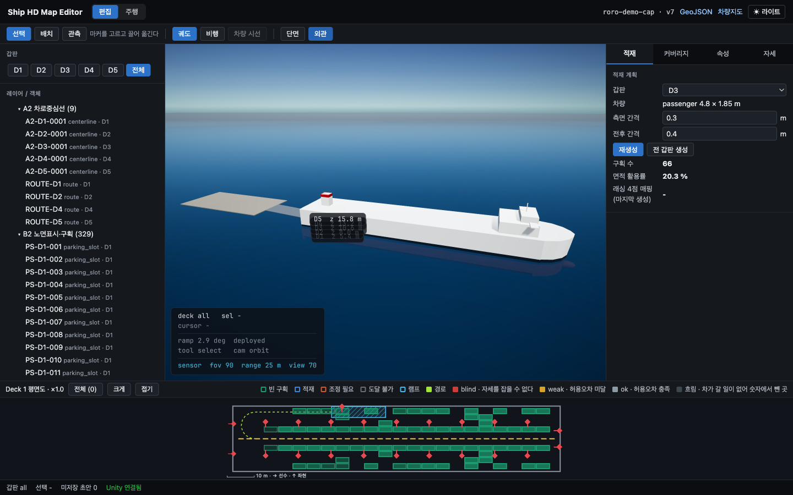
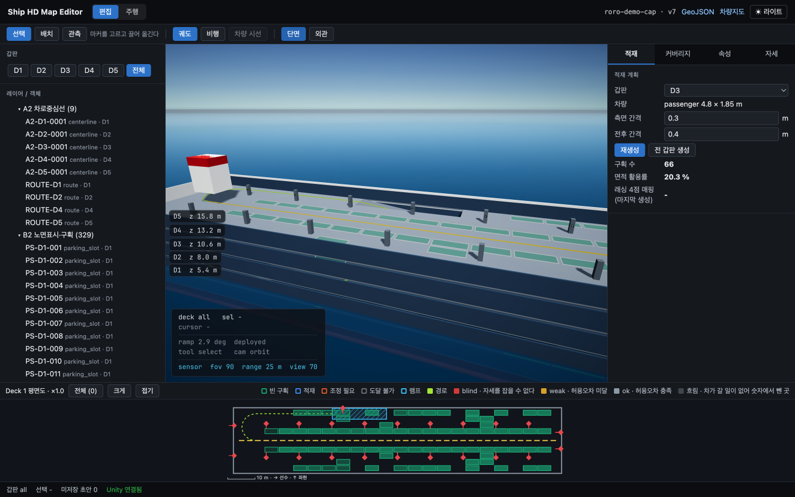
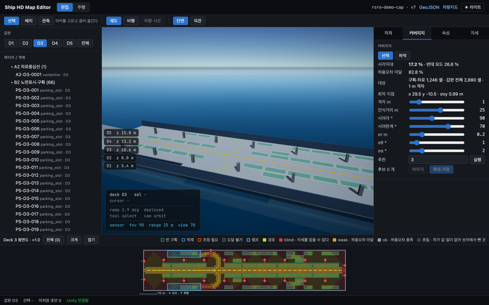
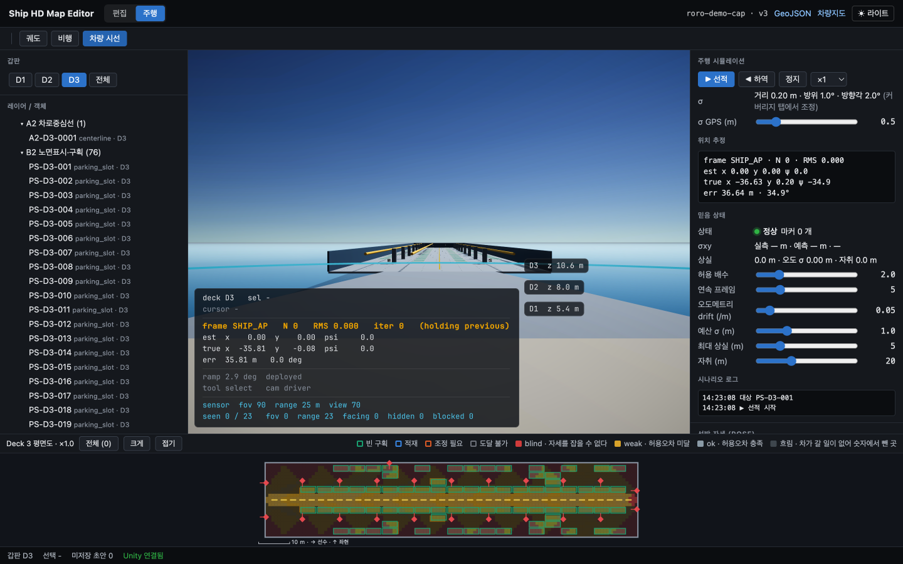
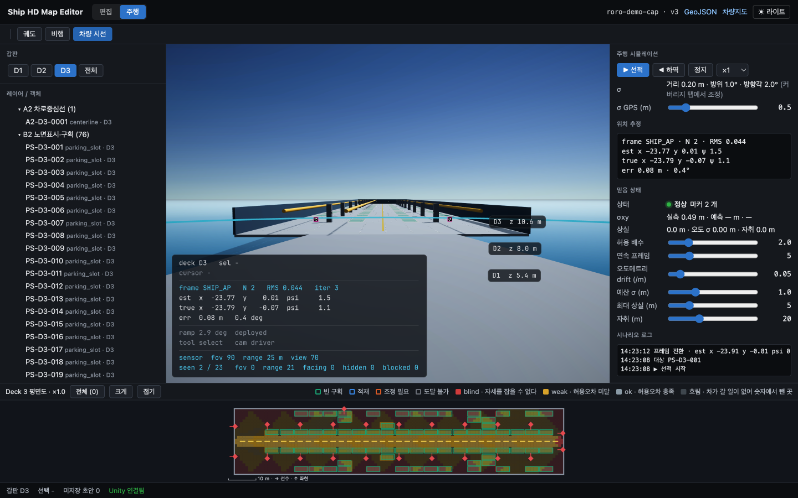
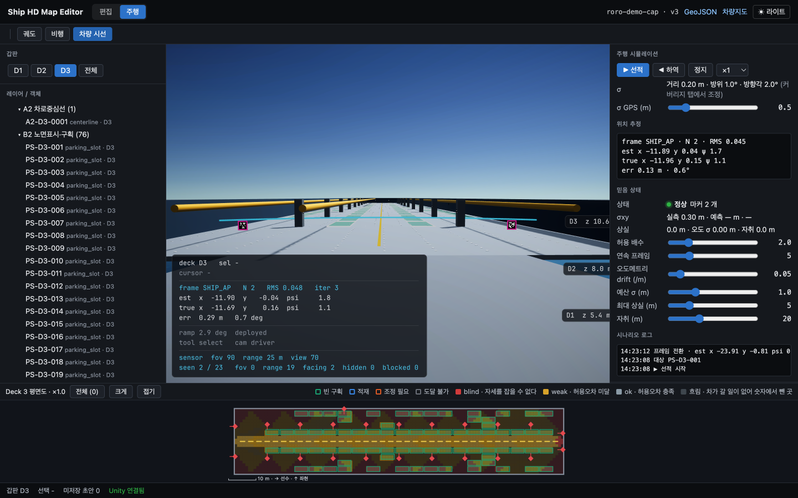
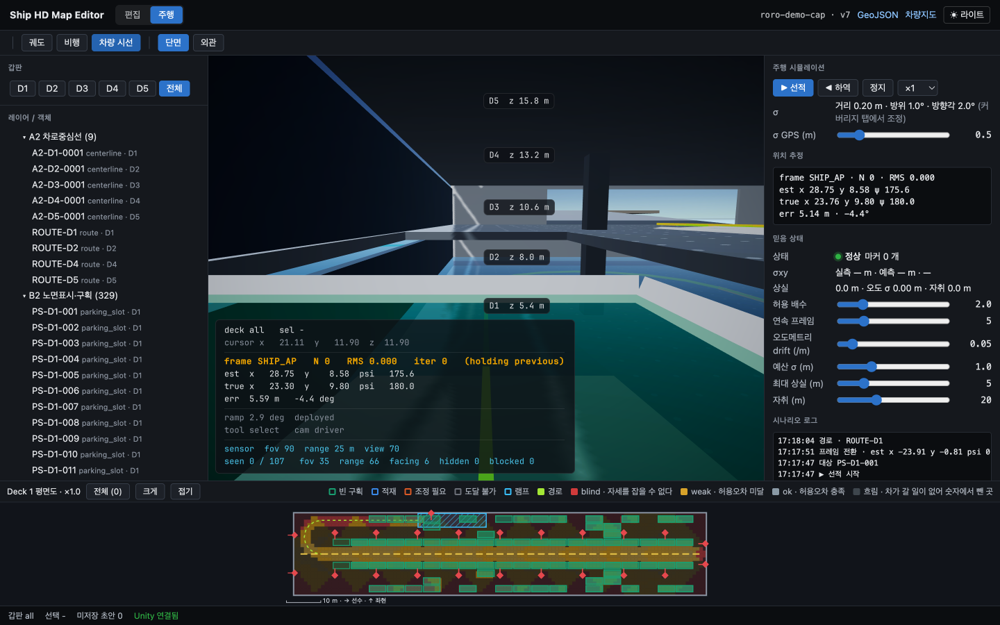
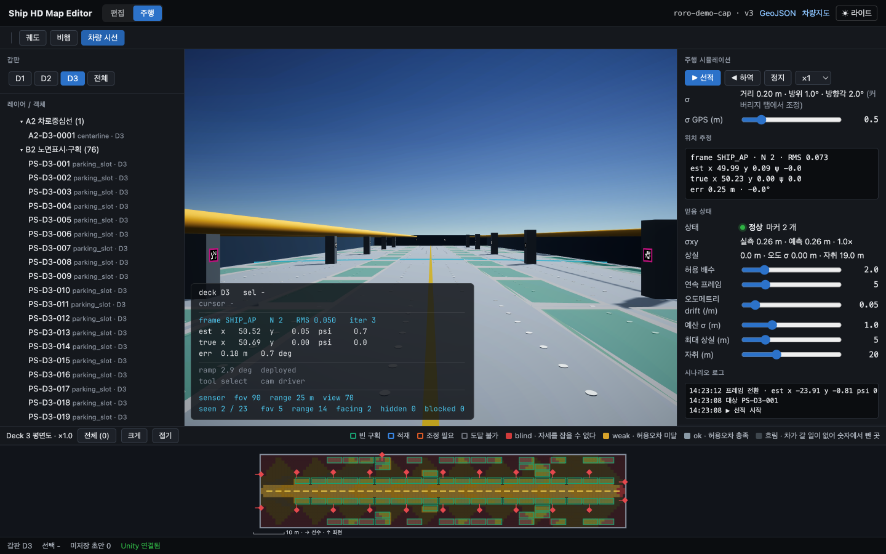
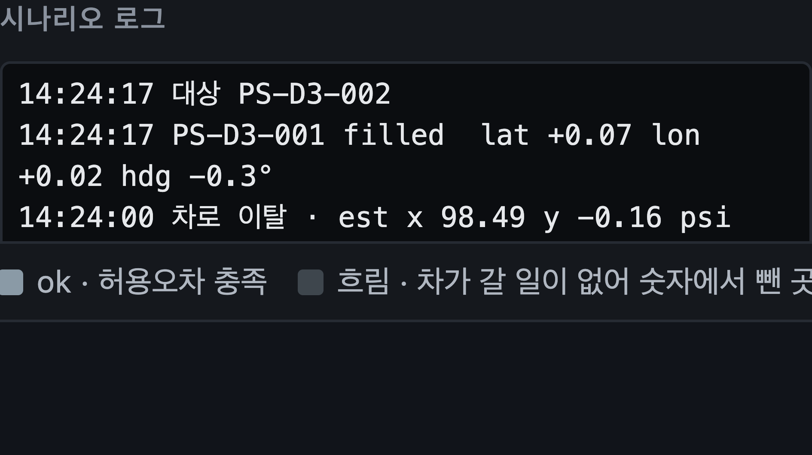
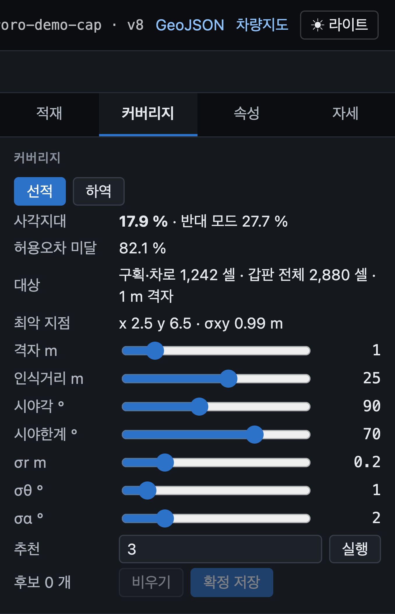

# 주행 한 번을 끝까지 따라가기

> 이 문서의 그림과 숫자는 모두 `./scripts/capture.sh`가 만듭니다. 확인이 필요하면 다시 실행해 요약표와 대조합니다.
> 기준 빌드: `unity.wasm` `2026-09-28 16:21:10` · 데이터셋: `roro-demo-cap` (`docs/fixtures/vehicle-map.sample.json` 시드 + 전 갑판 구획 자동생성) · `v7` · 5 갑판 · 23,823 피처

안벽에 선 차량 한 대가 선미 램프로 D3 에 오르고, 내부 램프 두 개를 내려가 가장 먼 갑판 D1 의 구획 `PS-D1-001`에 들어가 판정을 받기까지를 따라갑니다. 각 장은 한 가지 질문에 답합니다. **지금 어느 좌표계에 있고, 무엇이 계산되며, 그 코드는 어디에 있는가.**

장 경계는 새로 만든 것이 아니라 `MapRuntime.Phase`와 시나리오 이벤트에 이미 정의된 것입니다. 위상이 하나 늘어나면 이 문서에서 빠진 장이 자연스럽게 드러납니다.

| 장 | 코드의 경계 | 그림 |
|---|---|---|
| [0 바깥에서 본 배](#0-바깥에서-본-배) | (정지) | `00-exterior` |
| [1 배와 좌표계](#1-배와-좌표계) | (정지) | `01-frames` |
| [2 지도가 약속하는 것](#2-지도가-약속하는-것) | (편집 모드) | `02-coverage` |
| [3 부두](#3-부두) | `Phase.OnQuay` | `03-quay` |
| [4 프레임 전환](#4-프레임-전환) | `frame_switch` 이벤트 | `04-frame-switch` |
| [5 램프](#5-램프) | `Phase.OnRamp` | `05-ramp` |
| [5b 내부 램프](#5b-내부-램프) | `Phase.OnRoute` · `route` 이벤트 | `05b-inner-ramp` |
| [6 차로](#6-차로) | `Phase.OnLane` · `lane` 이벤트 | `06-lane` |
| [7 주차](#7-주차) | `Phase.Parking` → 판정 | `07-parked-log` |
| [8 약속과 실측의 대조](#8-약속과-실측의-대조) | (정지) | `08-promise-vs-measured` |

**램프는 `frame_switch` 뒤, `leave_lane` 앞입니다.** 순서를 반대로 기억하기 쉬워 미리 명시합니다. 차량은 안벽에서 이미 선박 프레임으로 전환한 뒤 램프를 오릅니다. 램프에는 별도의 로그 줄이 없으며, `프레임 전환` 줄과 `차로 이탈` 줄 사이의 구간이 램프입니다.

각 장에는 전체 프레임 한 장과 HUD 확대 클립(`-hud`) 한 장이 있으며, 7장에만 로그 클립이 한 장 더 있습니다. 0장은 전체 프레임 한 장뿐이고, 2장에는 같은 화면의 라이트 테마 그림(`02-coverage-light`)이 더 있습니다.

### 숫자의 등급

| 등급 | 무엇 | 어디서 |
|---|---|---|
| **고정** | 지도·구획·커버리지 수치, 센서 파라미터, 장 경계, 빌드 스탬프 | 캡처 스크립트의 stdout 요약표. 여러 번 실행해도 같습니다. |
| **이번 실행만** | `est` 값, 주차 오차, 판정(`filled`/`needs_adjust`) | 캡처 스크립트의 stderr. **실행마다 바뀝니다.** 이유는 [8장](#8-약속과-실측의-대조)에 설명합니다. |

아래에서 "이번 실행"이라고 적은 숫자는 그림에 표시된 예시일 뿐입니다. 다시 실행했을 때 같은 값이 나올 것으로 기대하면 안 됩니다.

---

## 0. 바깥에서 본 배



툴바의 `외관`으로 본 자동차운반선(PCTC)입니다. 상자형 선체, 선수 쪽 거주구·조타실, 선미 쪽 굴뚝, 선미 램프와 부두가 보입니다. 선체는 지도 데이터와 같은 생성기(`HullBuilder.cs`)가 갑판 외곽에서 만들므로 치수가 항상 맞습니다. 외피에는 콜라이더가 없어 클릭이나 센서 시선을 가로막지 않습니다. 기본 보기인 `단면`은 좌현 외판과 지붕을 걷어 안쪽 갑판을 보여 줍니다.

**파일** — `HullBuilder.cs` · `ShipMeshBuilder.cs` · `MapRuntime.SetShellMode`

---

## 1. 배와 좌표계



정지 상태의 선박입니다. 갑판 다섯 개가 겹쳐 보이고, 왼쪽 라벨에는 각 갑판의 높이가 `z 5.4` / `8.0` / `10.6` / `13.2` / `15.8` m로 표시됩니다. 선미 램프는 가운데 갑판 D3 에 닿고, 좌현의 내부 램프 두 개가 D3→D2→D1 로 내려가며 우현의 두 개가 D3→D4→D5 로 올라갑니다(평면도의 빗금). 오른쪽 적재 패널은 D3 가 `passenger 4.8 × 1.85 m` 차량 기준으로 **66구획**임을 보여 줍니다. 다른 갑판으로 가는 경로가 D3 를 가로지르므로 M7 의 76구획보다 적습니다. 다섯 갑판을 모두 생성하면 **329구획**입니다.

HUD([`01-frames-hud.png`](img/01-frames-hud.png))의 마지막 줄 `sensor fov 90 range 25 m view 70`은 8장에서 다시 사용합니다.

**좌표계는 세 가지이며, 이 문서는 각 장에서 사용하는 좌표계를 밝힙니다.**

| 이름 | 정의 | 언제 |
|---|---|---|
| **Ship Frame** | `x` 선미수선(AP)에서 선수 방향, `y` 좌현 +, `z` 기선에서 위, ψ 는 `+x` 에서 반시계 | 지도의 **모든** 좌표. 4~8장 |
| **Quay Frame** | Unity 월드 좌표. 차가 Map 루트에 붙어 있지 않은 동안의 프레임 | 3장 |
| **WGS84** | `ap_lat` / `ap_lon` / `heading_deg` 세 값이 Ship Frame 을 지구에 앉힌다 | GeoJSON 내보내기, QGIS 대조 |

Ship Frame의 정의는 세 언어에 각각 있으며 서로 같습니다: `unity/Assets/ShipHdMap/Runtime/Core/ShipFrame.cs`, `api/src/main/java/com/shiphdmap/api/geo/ShipFrame.java`, `web/src/geo/shipFrame.ts`.

주의할 점은 두 가지입니다.

- **Unity 엔진 축은 Ship Frame이 아닙니다**(엔진은 `x` 전방, `y` 위, `z` 우현). 변환은 `ToUnity(x,y,z) → (x, z, -y)` 하나뿐이고, 그 덕에 **Unity yaw가 곧 선수각**이므로 각도 변환이 없습니다.
- **`georef.heading_deg`와 ψ는 다른 양입니다.** 전자는 진북 기준 시계방향 선수 방위각이며 WGS84 변환에만 사용합니다. ψ는 `+x` 축 기준 반시계방향입니다.

**파일** — `ShipFrame.cs` · `ShipFrame.java` · `shipFrame.ts`(`toWgs84`) · 갑판과 선체를 그리는 `ShipMeshBuilder.cs` · 지도 피처를 씬에 얹는 `MapOverlay.cs`

---

## 2. 지도가 약속하는 것



Deck 3만 남기고 커버리지 탭을 연 화면입니다. 평면도의 색은 셀별 판정을 나타내며, 오른쪽 패널은 이를 숫자로 요약합니다.

| 항목 | 값 |
|---|---|
| 사각지대 | **17.2 %** (반대 모드 26.6 %) |
| 허용오차 미달 | **82.8 %** |
| 대상 | 구획·차로 **1,246 셀** · 갑판 전체 2,880 셀 · 1 m 격자 |
| 최악 지점 | x 29.5 y −10.5 · σxy **0.99 m** |

**분모는 갑판이 아닙니다.** 1,246은 구획과 차로가 덮는 셀이고, 2,880은 갑판 전체 셀입니다. 차량이 이동하지 않는 셀은 흐리게 표시되지만 비율에는 포함되지 않습니다. 다른 갑판으로 가는 **경로 구간도 차가 달리는 땅이므로 포함됩니다**(`ShipLayout.routeRunsOn`). 경로의 U턴이 들어오면서 대상 셀이 늘고 사각지대 비율도 조금 올랐습니다.

**어떤 계산인지 설명합니다.** 주행은 전혀 포함하지 않습니다. Ship Frame 1 m 격자의 각 셀 중심에 차량이 차로 방향으로 서 있다고 가정하고, 순수 기하만으로 계산합니다.

1. **보이는 마커 세기** — 세 조건을 적용합니다: 거리 ≤ 인식거리 25 m, 차량 정면 기준 |방위| ≤ 시야각 90°/2, 마커 법선 기준 |입사각| ≤ 시야한계 70°.
2. **정보행렬 쌓기** — 관측마다 야코비안을 `1/σ²`로 가중해 3×3 행렬 `A`에 누적합니다. 가중치의 σ는 패널의 σr 0.2 m · σθ 1° · σα 2°입니다.
3. **σ 계산하기** — `A⁻¹`의 대각에서 σxy와 σψ를 구합니다. 마커가 0개이거나 `A`의 역행렬이 없으면 **사각지대**로 판정합니다.
4. **판정하기** — `stability = min(0.15 / σxy, 2.0 / σψ)`. 1보다 작으면 **허용오차 미달**입니다.

3번의 `0.15 m`와 `2.0°`는 임의의 상수가 아니라 **7장의 주차 판정에서 사용하는 허용오차**입니다(`CoverageAnalyzer.TOL_LAT_M` / `TOL_HEADING_DEG` ↔ `ScenarioPlanner.Judge`의 `tol`). 히트맵은 "여기에 서면 주차 판정을 통과할 만한 정밀도가 나오는가"를 미리 계산한 것입니다.

**파일** — `api/src/main/java/com/shiphdmap/api/coverage/CoverageAnalyzer.java`(`visible` / `estimate` / `stability` / `analyze`) · `CoverageController.java` · `web/src/components/CoveragePanel.tsx` · `web/src/geo/coverage.ts`

---

## 3. 부두



차량 시점으로 전환한 첫 장입니다. 선박은 아직 멀리 있고, 화면에는 마커 링이 하나도 없습니다.

HUD([`03-quay-hud.png`](img/03-quay-hud.png))가 이를 숫자로 보여 줍니다. `seen 0 / 107   fov 0  range 107`은 다섯 갑판의 마커 107개가 모두 **거리** 때문에 제외되었다는 뜻입니다. 해가 없으므로 `N 0   RMS 0.000   iter 0   (holding previous)`이고, `est x 0.00 y 0.00`는 추정값이 원점에 있다는 뜻이 아니라 **직전 해가 없어 초기값을 유지하고 있다**는 뜻입니다. 따라서 `err 35.98 m`도 추정 오차가 아닙니다. 오른쪽 믿음 패널의 `σxy 실측 — · 예측 —`도 같은 사실을 다르게 표현한 것입니다.

**좌표계는 Quay Frame입니다.** 차량은 `Vehicle.transform.SetParent(null, true)`로 Map 루트에서 분리되어 Unity 월드에 놓입니다.

**무엇이 계산되는지 설명합니다.** 차량이 가진 것은 GPS 하나입니다.

1. 진값 `(-45, 6)`에 스폰합니다(`ScenarioPlanner.QuaySpawn`).
2. `Sensor.Gps(truth)`가 x·y에 σ GPS 0.5 m의 가우스 잡음을 더한 **추정** 하나를 제공합니다. 선수각은 나침반/IMU로 알고 있다고 가정해 그대로 복사합니다.
3. 해당 **추정 프레임**에서 램프 발치까지 경로를 그린 뒤(`QuayPath`), `ToTruthFrame`으로 실제 프레임에 옮겨 실행합니다.

3번이 핵심입니다. 차량은 자신의 추정이 틀렸다는 것을 모르므로, **GPS 오차만큼 비뚤어진 방향으로 램프를 향합니다.** σ GPS를 0으로 내리면 정확히 정중앙으로 진입합니다.

HUD에 `frame SHIP_AP`라고 표시되는 것은 모순이 아닙니다. 지도와 센서가 선박 프레임을 사용하므로, 차량이 Quay Frame을 주행하는 동안에도 **진값은 Map 루트의 역변환으로 선박 프레임에 투영해** 관측을 계산합니다(`MapRuntime.ShipTruthPose`). HUD의 `est`/`true`는 이렇게 투영된 값입니다.

**파일** — `MapRuntime.NextVehicle`(Quay 분기) · `ScenarioPlanner.cs`(`QuaySpawn` / `QuayPath` / `ToTruthFrame`) · `LandmarkSensor.Gps`

---

## 4. 프레임 전환



이 장면은 이 데모에서 "선내 좌표는 부두 좌표와 무관하다"는 주장이 실제 값으로 나타나는 **유일한 순간**입니다.

HUD([`04-frame-switch-hud.png`](img/04-frame-switch-hud.png))에서 마커 두 개가 처음 인식됩니다. `seen 2 / 107   fov 0  range 105`로 표시되며, `N 2   RMS 0.109   iter 3`부터 해가 나오기 시작합니다. 이번 실행의 값은 `est x -23.90 y 0.53 psi -0.6` 대 `true x -23.90 y -0.07 psi 1.1`, `err 0.61 m  -1.7 deg`입니다.

**트리거는 시간이 아니라 사건입니다.** 램프가 지정한 `transition_landmarks` 두 개(`LM-0022`, `LM-0023`)를 **같은 프레임에서 모두** 인식했을 때 전환합니다(`SawEntrancePair()`). 하나만 보이는 동안에는 전환하지 않습니다.

해당 프레임에서는 세 가지가 동시에 일어납니다.

1. **부모 교체** — `SetParent(transform, true)`. 월드 포즈는 그대로 둔 채 부모만 Unity 월드에서 Map 루트로 바꿉니다. 이후 차량의 좌표는 선박 프레임을 사용하고, 선박이 흘수나 횡경사로 움직이면 차량도 함께 움직입니다.
2. **경로 재계획** — **이 순간의 추정 하나**(`_prev`)로 램프 상단까지의 경로를 그립니다(`RampTopPath`). 끝점은 D3 차로의 시작점이며, 목표가 다른 갑판이면 그 갑판으로 가는 경로의 시작점입니다(둘은 같은 점). 추정이 틀린 만큼 램프 꼭대기에도 비뚤게 올라갑니다. 이후에는 경로·차로 추종이 차량을 다시 중앙으로 이동시킵니다.
3. **이벤트 발행** — `frame_switch`를 `detail: "est x … y … psi …"`와 함께 내보냅니다. 로그 패널의 `프레임 전환 · est …` 줄이 해당 이벤트이며, 포함된 값이 바로 2번에서 사용한 추정입니다.

2번에서 추정이 없으면 진값으로 바로 대체하지 않고 마지막으로 **유한했던** 해를 사용합니다(`_prev ?? ShipTruth()`, 그리고 `_prev`는 `IsFinite`를 통과한 해에서만 갱신됩니다). 이 데모는 추정 오차를 보여 주기 위한 것이므로, 이 지점에서 진값이 개입하면 비교의 의미가 사라집니다.

**파일** — `MapRuntime.StepScenario` 의 `case Phase.OnQuay when SawEntrancePair()` · `MapRuntime.SawEntrancePair` · `ScenarioPlanner.RampTopPath` / `ToTruthFrame` · 램프 정의는 `docs/fixtures/vehicle-map.sample.json` 의 `ramps` 중 `type: "stern_quarter"`. 차량지도는 램프를 id 순으로 내보내므로 선미 램프가 `ramps[0]` 이라는 보장은 없습니다(`RampPlanner.Stern`)

---

## 5. 램프



램프는 안벽 발치(x ≈ −24)에서 차로 시작점(x = 2)까지 이어집니다. 이 그림은 중간 지점을 고정하기 위해 **`true x ≥ -12 m`인 첫 추정**에서 캡처했습니다. 시각이 아니라 **장소**를 기준으로 정했기 때문에 프레임률이 달라도 같은 갑판 위치가 찍힙니다.

HUD([`05-ramp-hud.png`](img/05-ramp-hud.png)): `est x -11.18 y 0.30` / `true x -11.36 y 0.17` / `err 0.23 m  -0.9 deg`, `seen 2 / 107`, `ramp 2.9 deg  deployed`.

**이 장의 핵심은 오른쪽 믿음 패널에 있습니다.**

```
σxy    실측 0.30 m · 예측 — m · —
```

**예측이 비어 있습니다.** 커버리지 격자의 bbox는 갑판 외곽인 `[0, -12] ~ [120, 12]`이고, 램프는 `x < 0`이므로 격자 밖입니다. `PredictionGrid.SigmaAt`은 셀이 없으면 `null`을 반환하며, **지도가 약속하지 않은 자리와 지도가 사각지대라고 판정한 자리에 의도적으로 같은 답을 사용합니다.** 둘 다 "이 값을 비교할 기준이 없다"는 뜻이기 때문입니다. `BeliefMonitor`는 약속이 없으면 "약속보다 나쁨" 판정을 건너뛰고, 관측 수만 사용하는 상실/후진 판정은 그대로 실행합니다.

추가 조건도 있습니다. **믿음 감시 자체는 `OnLane` / `Parking` / `Departing`에서만 실행됩니다**(`MapRuntime.Step`). 안벽과 램프, 다음 장의 경로에서는 마커가 없거나 적어 `nObs`가 0이 되는 것이 정상인데, 감시를 활성화하면 정상 주행에서도 상실 상태로 전환됩니다. 따라서 이 구간에서는 `Belief.Reset()`만 실행합니다.

**파일** — `unity/Assets/ShipHdMap/Runtime/Vehicle/PredictionGrid.cs` · `BeliefMonitor.cs` · `MapRuntime.Step`(위상별 감시 분기) · `ScenarioPlanner.RampTopPath`

---

## 5b. 내부 램프



목표 `PS-D1-001` 은 D3 가 아니므로, 선미 램프 끝에서 **경로 `ROUTE-D1`** 이 시작됩니다(로그의 `경로 · ROUTE-D1`). 경로는 3D 폴리라인 하나입니다: D3 중앙선을 따라 x 40 까지, 기둥 사이에서 좌현으로 U턴, 선측 띠(y 9.8)를 따라 선미 방향으로 `RAMP-D3-D2` 를 내려가 D2 선미에서 U턴, D2 중앙선으로 x 62 까지 간 뒤 같은 식으로 `RAMP-D2-D1` 을 내려가 D1 차로 시작점(8, 0)에서 끝납니다. 그림은 **경로가 시작된 뒤 좌현에서 `true x ≤ 24 m`가 된 첫 추정**, 곧 첫 내부 램프의 중간입니다.

**경로는 차선처럼 정확히 추종합니다.** 차선 유지가 이상적이라는 가정은 차로와 같고, 추정 오차는 차로를 벗어나 구획으로 들어가는 순간에만 주차 오차가 됩니다(7장). 그래서 HUD([`05b-inner-ramp-hud.png`](img/05b-inner-ramp-hud.png))가 램프 위에서 `seen 0 / 107`, `N 0 … (holding previous)`, `err 5.59 m`를 보여도 차는 경로를 벗어나지 않고, 믿음 감시도 이 구간에서는 판정하지 않습니다. 측위는 D1 차로에 들어서면 곧 회복됩니다(6장). 램프 위의 시야는 이 데모가 드러내는 **실제 과제**이기도 합니다. 램프 주변에 마커를 두면 이 구간도 관측할 수 있습니다.

**내부 램프는 호이스트형입니다.** 힌지는 윗갑판 끝에 있고, 전개하면 아랫갑판으로 7.47° 기울며, 수납하면 윗갑판과 같은 높이의 덮개가 됩니다. 선적은 **먼 갑판부터**(D1 → D5 → D2 → D4 → D3) 진행하고, 어떤 램프 너머의 구획이 모두 차면 그 램프를 수납합니다(`onScenario` `ramp` 이벤트). 수납된 램프 자리는 가까운 쪽 갑판의 바닥이 되어 구획이 됩니다. 이 순서는 구획의 `sequence_no`(갑판 순위 × 1000 + 갑판 내 순번)에 한 번에 담겨 있습니다.

**파일** — `ShipSeedBuilder.InternalRamps`(램프·경로 생성) · `RampPlanner.cs`(가용성·전개/수납 판단) · `MapRuntime.StartRoute` / `SetRamp` · `RampHoist.cs` · `api/.../layout/ShipLayout.java`(경로 구간·먼 쪽 램프 자리·갑판 순위)

---

## 6. 차로



D1 차로에 들어선 뒤(`lane` 이벤트) **`true x ≥ 50 m`인 첫 추정**입니다. 경로가 D2 에서도 x 50 을 지나가므로, 차로 진입 이벤트를 먼저 기다린 뒤 장소를 잡습니다. 기둥에 달린 마커 두 개가 자홍색 링으로 표시되어 있으며, 현재 해에 실제로 사용된 관측입니다.

HUD([`06-lane-hud.png`](img/06-lane-hud.png))에는 `N 2   RMS 0.058   iter 3`, `est x 50.50 y 0.18` / `true x 50.50 y 0.00`, `seen 2 / 107   fov 25  range 62  facing 10  hidden 0  blocked 8`가 표시됩니다. 마커 107개 중 105개가 제외된 이유도 함께 표시되며, `blocked 8`은 다른 갑판의 마커가 바닥에 가려진 것입니다.

**좌표계는 Ship Frame이며, 렌더 프레임마다 네 단계를 실행합니다**(`MapRuntime.Localize`).

1. `Sensor.VisibleFrom` — 마커별 가시 여부와 보이지 않는 이유(`fov` / `range` / `facing` / `hidden` / `blocked`)를 계산합니다. 차량 시점에 표시되는 콘과 링은 이 판정을 그대로 반영합니다.
2. `Sensor.Sense` — 보이는 마커마다 거리·방위·입사각에 가우스 잡음을 더합니다(σr 0.2 m · σθ 1° · σα 2°).
3. `Localizer.Solve` — Gauss-Newton으로 포즈를 풉니다. 잔차 가중은 `1/σ²`, 즉 **2장의 커버리지에서 사용한 것과 같은 가중**입니다.
4. `Localizer.Information` — 같은 `A⁻¹` 대각에서 σxy·σψ를 구합니다.

차로 구간에서는 차로를 추종하므로 추정 오차가 누적되지 않습니다. 매 프레임에서 새로 계산하고, 오차만큼 다시 중앙으로 이동합니다.

오른쪽 믿음 패널(이번 실행):

```
σxy    실측 0.26 m · 예측 0.26 m · 1.0×
상실   0.0 m · 오도 σ 0.00 m · 자취 19.2 m
```

**실측이 예측과 같습니다.** 이 두 숫자를 나란히 비교할 수 있다는 점이 8장의 주제입니다.

**파일** — `LandmarkSensor.cs`(`VisibleFrom` / `Sense` / `AddNoise`) · `Localizer.cs`(`Solve` / `Information` / `Weight`) · `LaneFollower.cs` · `SensorView.cs`(콘·링) · `web/src/components/DrivePanel.tsx`(믿음 패널)

---

## 7. 주차



판정(`onSlotFilled`)과 다음 차량의 `target`은 `NextVehicle`의 같은 프레임에서 발생합니다. 따라서 방금 주차한 차량의 판정값을 그대로 남긴 시나리오 로그 클립을 이 장의 주 그림으로 사용합니다. 캡처할 때만 로그 본문을 줄바꿈해 `lat` · `lon` · `hdg` 판정값이 한 그림 안에 모두 보이도록 합니다.

**무엇이 계산되는지 설명합니다.** 차로를 벗어나는 순간의 값이 핵심입니다.

1. **이탈 지점** — 목표보다 `FinalRunM` 5 m에 횡오프셋 `|t.y − laneY|`를 더한 거리만큼 앞선 지점(`ExitS`)입니다. 접근 경로가 45° 대각선과 마지막 직진 5 m로 구성되도록 정한 값입니다.
2. **경로 계획** — 해당 순간의 **추정 하나**로 목표까지 경로를 그리고(`ApproachPath`), `ToTruthFrame`으로 옮겨 **개루프**로 실행합니다. 이후 프레임의 추정은 경로에 반영되지 않습니다.
3. **판정** — 도착하면 `Judge`가 **진값**과 `target_pose`를 비교합니다. 목표 선수각을 기준으로 종·횡방향으로 분해한 뒤 `lat 0.15 m` / `lon 0.30 m` / `heading 2.0°`와 비교합니다. 세 항목을 모두 통과하면 `filled`, 하나라도 초과하면 `needs_adjust`입니다.

2번은 이 데모의 구조적 선택입니다. **차로를 벗어나는 순간의 추정 오차가 그대로 주차 오차가 됩니다.** 매 프레임의 추정으로 다시 조준하는 폐루프 방식이 개선 방향이며, 코드에도 그렇게 명시되어 있습니다.

또한 이탈이 정확히 이탈 지점에서 일어나도록 한 프레임을 되감습니다(`Vehicle.Rewind(_exitS)`). 시간 배율이 높으면 한 프레임에 수 미터를 지나가고, 그 초과분이 그대로 주차 오차에 더해지기 때문입니다.

**파일** — `MapRuntime.StepScenario` 의 `case Phase.OnLane when …` 와 `case Phase.Parking when Vehicle.AtEnd` · `ScenarioPlanner.cs`(`ExitS` / `ApproachPath` / `Judge` / `FinalRunM`) · `MapOverlay.SetStatus` / `SpawnParked`

---

## 8. 약속과 실측의 대조



상단의 `편집` 탭으로 전환한 뒤 커버리지가 새로 계산될 때까지 기다립니다. 이후 차가 주차한 갑판(D1)의 트리에서 `PS-D1-001`을 선택해 방금 주차한 결과를 확인하고, 커버리지 패널을 다시 열어 상단 버전과 최종 계산이 함께 보이도록 확대해 캡처합니다.

패널의 숫자는 **D1** 의 약속입니다: 사각지대 17.9 % · 반대 모드 27.7 % · 허용오차 미달 82.1 % · 1,242 / 2,880 셀 · 최악 지점 x 2.5 y 6.5 σxy 0.99 m. 커버리지는 주행 결과와 무관한 정적 계산이므로 캡처를 다시 해도 같습니다. 주행이 바꾼 것은 상단바의 `v7` → `v8`뿐입니다.

### 8.1 이 비교가 성립하는 이유

2장의 예측과 6장의 실측을 나란히 비교할 수 있는 것은 **둘이 같은 센서 파라미터에서 나왔기 때문입니다.**

| | 2장 (예측) | 3~7장 (실측) |
|---|---|---|
| 기하 | 커버리지 슬라이더 — 시야각 **90**° · 인식거리 **25** m · 시야한계 **70**° | HUD 의 `sensor fov 90  range 25 m  view 70` ([`08-…-hud.png`](img/08-promise-vs-measured-hud.png), [`02-…-hud.png`](img/02-coverage-hud.png) 에도 같은 줄) |
| 잡음 | 커버리지 슬라이더 — σr **0.20** m · σθ **1.0**° · σα **2.0**° | 주행 패널 σ 행 — `거리 0.20 m · 방위 1.0° · 방향각 2.0°` |

여섯 값이 같은 데서 그치지 않고, **출처도 하나입니다.** 웹 스토어의 `coverageParams` 객체 하나가 세 갈래로 전달됩니다. 히트맵의 커버리지 POST 본문, `sensorMsg()` / `noiseMsg()`를 거친 브리지의 `SetSensor` / `SetNoise`, 그리고 주행 시작 시 `predictionMsg()`가 조립하는 예측 격자 POST입니다. 예측 격자 POST의 응답은 `SetPrediction`으로 전달되어 8.2의 "지도의 약속"이 됩니다. 슬라이더를 움직이면 히트맵과 차량과 약속이 **함께** 바뀝니다.

이 문서를 작성할 수 있게 된 기준점이 바로 이 부분입니다. 그전까지 히트맵은 웹 슬라이더를 읽고 씬 안의 센서는 Unity 상수를 읽었으며, **둘을 연결하는 코드가 없었습니다.** 두 σ가 우연히 같은 값일 수는 있어도 같다는 보장이 없었으므로, 나란히 비교하는 것 자체가 의미가 없었습니다.

주행 패널의 σ 행이 슬라이더가 아니라 읽기 전용 표시로 제공되고 `(커버리지 탭에서 조정)`이라는 안내가 붙은 것도 같은 이유입니다. 조정 지점이 두 곳이면 값이 다시 달라질 수 있습니다.

### 8.2 약속은 지켜졌습니다

차로 중간(x ≈ 50)에서:

| | σxy |
|---|---|
| 지도의 약속 (커버리지 셀 x 50.5 y 0.5, 마커 2 개) | **0.26 m** |
| 6장의 실측 (이번 실행, D1) | **0.26 m** · 비 **1.0×** |

달성 가능한 정밀도가 지도에서 미리 계산한 값과 일치했습니다. 지도는 "이 자리에서는 마커 2개가 보이고, 그 관측으로 낼 수 있는 최선은 0.26 m"라고 예측했으며, 실제 해도 동일하게 나왔습니다.

### 8.3 판정은 실행마다 달라지며, 이 또한 지도의 예측과 일치합니다

같은 구획이 어떤 실행에서는 `filled`, 다른 실행에서는 `needs_adjust`가 됩니다. 주차 오차도 실행마다 다릅니다. 이는 모순이 아니라 8.2와 **같은 사실의 다른 면**입니다.

- 횡 허용오차는 **0.15 m**입니다. 해당 위치의 약속은 **0.26 m**입니다.
- 따라서 `stability = 0.15 / 0.26 = 0.59 < 1`이며, 해당 셀은 **허용오차 미달**로 집계됩니다. D1 대상 셀의 **82.1 %**가 이에 해당합니다.
- 즉 지도는 처음부터 **"이 갑판 대부분에서는 0.15 m를 충족하지 못한다"**고 예측했습니다.
- σ는 **퍼짐**이지 한 번의 오차가 아닙니다. σ 0.26 m에서 뽑은 표본 하나는 0.15 m 안에 들어올 수도 있고, 들어오지 않을 수도 있습니다. **판정이 실행마다 달라지는 현상이 이를 보여 줍니다.**

매번 다른 표본이 나오는 이유는 센서 잡음을 **렌더 프레임마다** 추출하기 때문입니다(`LandmarkSensor.Sense` → `Gauss`). 시드는 `Awake()`에서 1로 고정하므로 난수열 자체는 재현되지만, **두 사건 사이에 몇 개를 추출했는지는 프레임률에 따라 달라집니다.** 시뮬레이션이 `Time.deltaTime`으로 진행되기 때문입니다. 따라서 `차로 이탈` 순간의 추정이 달라지고, 7장의 개루프 구조가 그 오차를 그대로 주차 오차로 옮깁니다.

**이 데모에서 개선할 대상은 주차 판정이 아니라 지도입니다.** 2장 패널의 `추천` 버튼은 이를 위해 제공됩니다. 마커를 어디에 추가하면 사각지대와 허용오차 미달이 얼마나 줄어드는지 계산해 순위로 제시합니다.

**파일** — `web/src/store/editor.ts`(`noiseMsg` / `sensorMsg`, 두 경로의 단일 출처) · `web/src/bridge/useShipUnity.ts`(`SetSensor` / `SetNoise` 발송) · `MapRuntime.SetSensor` / `SetNoise` · `HudView.SensorConfigLine` · `CoverageAnalyzer.stability` · `ScenarioPlanner.Judge` · `LandmarkSensor.Sense`

---

## 다시 만드는 법

```bash
./scripts/capture.sh > /tmp/cap.out 2> /tmp/cap.err
```

전제 조건은 API 8081 · postgis 5433 · vite 5399 · 디버깅 포트 9333의 Chrome에 `http://localhost:5399/` 탭이 열려 있는 것입니다. 스크립트는 서비스를 직접 시작하지 않습니다. 뷰포트는 1440 × 900 이어야 그림 크기가 맞습니다. 화면이 작은 컴퓨터에서는 headless Chrome(`--headless=new --window-size=1440,987 --force-device-scale-factor=2`)으로 띄우면 됩니다.

스크립트는 `docs/img/`의 이미지 22장을 새로 쓰고, 요약표를 stdout에, 이번 실행의 측정치를 stderr에 출력합니다. 스크립트는 매번 `roro-demo-cap`을 **삭제하고 다시 시드합니다.** `/seed`는 upsert 방식이라 이전 실행에서 수정한 피처를 삭제하지 못하고, 주행 자체도 구획 상태를 DB에 다시 쓰기 때문입니다. 삭제하지 않으면 다음 실행의 목표 구획부터 달라집니다.

`/tmp/cap.out`을 두 번 생성해 `diff`로 비교하면 같아야 합니다. `/tmp/cap.err`는 서로 달라도 정상이며, 그 이유는 8.3에 설명되어 있습니다.
