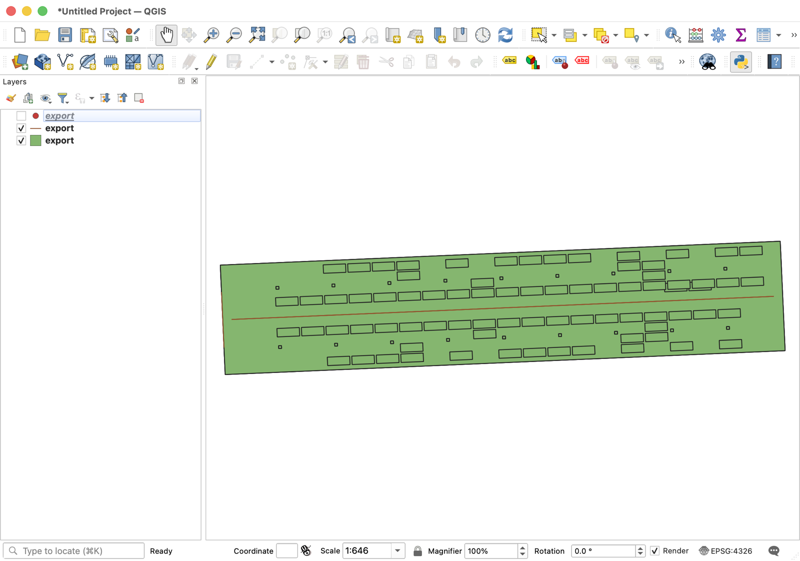

# QGIS 검증 절차

*기하 구조를 읽기 쉽도록 점 레이어(LP·LM)는 잠시 끈 화면이다. 선 레이어에는 중앙 차로가, 면 레이어에는 겹친 갑판 윤곽과 Deck 3 주차구획이 함께 보인다.*

- 목적: API 가 내보낸 WGS84 GeoJSON 이 갑판 윤곽 안에 기둥·랜드마크·차로·구획을 올바른 상대 위치로 놓는지 눈으로 확인
- 설치(macOS): `brew install --cask qgis` → `/Applications/QGIS-final-4_2_2.app`. 번들 GDAL 은 `…/Contents/MacOS/ogrinfo` 로 직접 부를 수 있다
- 내보내기: API 만 띄우고 `curl -s localhost:8081/api/datasets/roro-demo-01/export.geojson -o api/build/export.geojson`.
  `./scripts/m2-smoke.sh` 도 같은 파일을 만들지만 **픽스처를 다시 시드하므로 편집한 랜드마크와 생성한 구획이 초기 상태로 돌아간다** — 지금 DB 를 보고 싶으면 curl 쪽을 쓴다
- 열기: `open -a /Applications/QGIS-final-4_2_2.app api/build/export.geojson`, 또는 QGIS → Layer → Add Layer → Add Vector Layer. CRS 는 EPSG:4326 으로 인식됨
- 확인 1: 속성 테이블(F6)에서 `layer` 값이 DECK, C, LM, LP, A2, B2 로 나뉘는지
- 확인 2: `layer = 'DECK'` 필터 → 사각형 3개가 겹쳐 보이는지. 갑판은 120 × 24 m 인데 `heading_deg = 87.5` 로 회전해 있어 **bbox 는 120.9 × 29.2 m 로 잡힌다**(`120·cos2.5° + 24·sin2.5°`). 축척 막대로 긴 변을 재면 120 m
- 확인 3: `layer = 'LM'` → 점 23개가 **전부 Deck 3** 안쪽(마커는 주행하는 갑판에만 놓았다), 기둥(`kind = 'pillar'`, 54개) 옆에 붙어 있는지. 선수 격벽 마커는 짧은 변 위
- 확인 4: `layer = 'A2'` → 갑판 중앙을 지나는 선 3개(갑판당 1개). `layer = 'B2'` → 구획 사각형 76개, **전부 Deck 3**
- 확인 5: `layer = 'LP'` 는 래싱 포인트 4722개로 피처의 대부분이다. 격자가 고르게 깔렸는지만 보고, 느리면 레이어를 끈다
- 확인 6: pose 를 바꾸면(`PUT /api/datasets/{id}/pose` 의 heading_deg) 다시 내보낸 파일에서 전체가 회전하는지 — 선내 상대 위치는 그대로
- 정박 좌표(ap_lat, ap_lon)는 임의값이다. 실제 항구 위에 올려 보지 않는다
- GeoJSON 좌표의 세 번째 값(z)은 타원체고가 아니라 Ship Frame z(기준선 위 높이, m)다

숫자는 `docs/fixtures/vehicle-map.sample.json` 시드에 M4 구획 자동생성(Deck 3)과 M5a 선수 격벽 마커까지 반영한 상태 기준이다.
