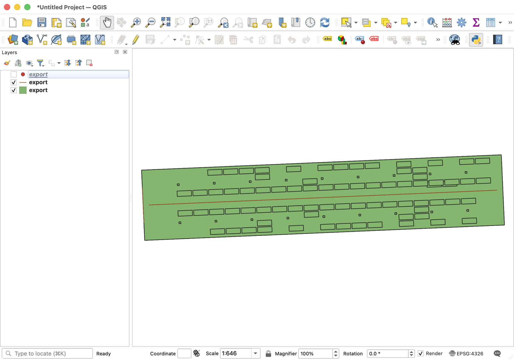

# QGIS 검증 절차

*기하 구조를 읽기 쉽도록 점 레이어(LP·LM)는 잠시 끈 화면입니다. 선 레이어에는 중앙 차로가, 면 레이어에는 겹친 갑판 윤곽과 Deck 3 주차구획이 함께 보입니다. (M7 기준 그림입니다. M8 이후 갑판은 5개이고 모든 갑판에 구획과 경로가 있습니다.)*

- 목적: API가 내보낸 WGS84 GeoJSON이 갑판 윤곽 안에 기둥·랜드마크·차로·구획을 올바른 상대 위치로 놓는지 눈으로 확인합니다.
- 설치(macOS): `brew install --cask qgis` → `/Applications/QGIS-final-4_2_2.app`. 번들 GDAL은 `…/Contents/MacOS/ogrinfo`로 직접 실행할 수 있습니다.
- 내보내기: API 만 띄우고 `curl -s localhost:8081/api/datasets/roro-demo-01/export.geojson -o api/build/export.geojson`.
  `./scripts/m2-smoke.sh`도 같은 파일을 만들지만 **픽스처를 다시 시드하므로 편집한 랜드마크와 생성한 구획이 초기 상태로 돌아갑니다.** 현재 DB를 확인하려면 curl 명령을 사용합니다.
- 열기: `open -a /Applications/QGIS-final-4_2_2.app api/build/export.geojson`, 또는 QGIS → Layer → Add Layer → Add Vector Layer. CRS는 EPSG:4326으로 인식됩니다.
- 확인 1: 속성 테이블(F6)에서 `layer` 값이 DECK, C, LM, LP, A2, B2로 나뉘는지 확인합니다.
- 확인 2: `layer = 'DECK'` 필터 → 사각형 5개가 겹쳐 보이는지 확인합니다. 갑판은 120 × 24 m이지만 `heading_deg = 87.5`로 회전해 있어 **bbox는 120.9 × 29.2 m로 잡힙니다**(`120·cos2.5° + 24·sin2.5°`). 축척 막대로 긴 변을 재면 120 m입니다.
- 확인 3: `layer = 'LM'` → 점 107개(D3 23개, 나머지 갑판 21개씩)가 갑판 윤곽 안쪽에 있고, 기둥(`kind = 'pillar'`, 90개) 옆에 붙어 있는지 확인합니다. 선수 격벽 마커는 짧은 변 위에 있습니다.
- 확인 4: `layer = 'A2'` → `kind = 'centerline'` 차로 5개(갑판당 1개)와 `kind = 'route'` 경로 4개를 확인합니다. 경로는 U턴과 내부 램프를 지나 갑판을 넘나드는 3D 선입니다. `layer = 'B2'` → 전 갑판을 생성했다면 구획 사각형 329개가 다섯 갑판에 나뉘어 있는지 확인합니다.
- 확인 5: `layer = 'LP'`는 래싱 포인트 23,610개(갑판당 4,722개)로 피처의 대부분을 차지합니다. 격자가 고르게 깔렸는지만 확인하고, 느리면 레이어를 끕니다.
- 확인 6: pose를 바꾸면(`PUT /api/datasets/{id}/pose`의 heading_deg) 다시 내보낸 파일에서 전체가 회전하는지 확인합니다. 선내 상대 위치는 그대로 유지됩니다.
- 정박 좌표(ap_lat, ap_lon)는 임의값입니다. 실제 항구 위에 올려 보지 않습니다.
- GeoJSON 좌표의 세 번째 값(z)은 타원체고가 아니라 Ship Frame z(기준선 위 높이, m)입니다.

숫자는 `docs/fixtures/vehicle-map.sample.json` 시드(M8: 5갑판·내부 램프·경로·전 갑판 래싱과 마커)에 전 갑판 구획 자동생성을 반영한 상태를 기준으로 합니다.
